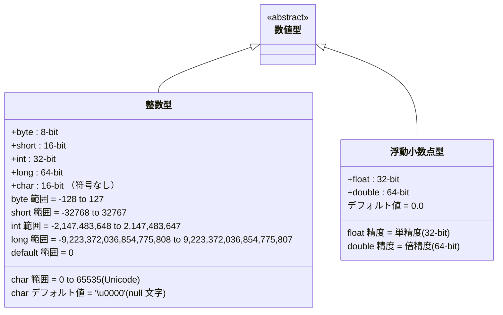
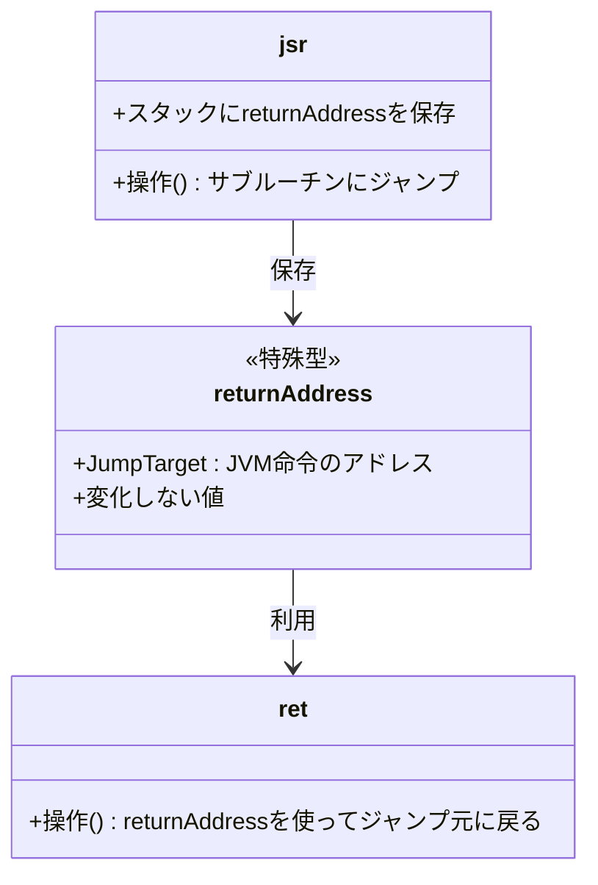

前回の続きです。前回はこちらから。

https://zenn.dev/peyang/articles/reading-jvm-chapter-01

このシリーズは，JVM の仕様書を読み解くためのガイドとして構成しています。
JVM の仕様書は非常に長大で難解な内容が多いため，各セクションごとに要点をまとめていきます。
また，JVM の内部構造や動作原理を知ることで，Java のパフォーマンスやセキュリティ，メモリ管理の仕組みを深く理解する試みです。

シリーズはこちらから。

https://zenn.dev/peyang/articles/reading-jvm-chapter-00

## 第二章 The Structure of the Java Virtual Machine

JVM の仕様書の第２章は「Java Virtual Machine の構造」です。
といいましてもこの章は全７章ある JVM の仕様書の中でも特に長く，また特に複雑な内容ですので，この記事では複数に分けて解説していきます。

ここでは Chapter 2.1, 2.2, 2.3 の内容（主にクラスファイルと型システム）を扱います。

## 2.1 `.class` ファイル形式（[› 2.1 The `class` File Format](https://docs.oracle.com/javase/specs/jvms/se24/html/jvms-2.html#jvms-2.1)）

JVM によって実行されるコードは，特定のハードウェアや OS に依存しない形式で表現します。
通常は クラス・ファイル・フォーマット（`class` file format）と呼ばれる形式で表現されます。
この形式は Java 言語で書かれたプログラムをコンパイルした結果生成されるバイトコードを表現するためのものです。

これにはクラスやインタフェースの定義，メソッドやフィールドの情報，定数プールなどが含まれます。
詳しくは第４章で解説します。

:::message
JVM が実行するのはこのバイトコードであり，Java 言語のソースコード自体や，クラス・ファイルではありません。
すなわち，バイト・コードは必ずしもクラス・ファイルに格納する必要があるわけではないのです。

もっというと， JVM は Java 言語に依存しているわけではなく，あくまでも独立した仮想マシンです。
ですから JVM は Java 言語以外の言語で書かれたプログラムも（対応したバイト・コードを生成するコンパイラがあれば）難なく実行できます。
:::

## 2.2 データ型（[› 2.2 Data Types](https://docs.oracle.com/javase/specs/jvms/se24/html/jvms-2.html#jvms-2.2)）

JVM は，**プリミティブ型**と**参照型**の２つのデータ型をサポートします。
+ **プリミティブ型**：数値や真偽値などの基本的なデータ型
+ **参照型**：オブジェクトや配列への参照を表す型

これらは，例えば変数に格納したり，或いは引数として渡したり，メソッドからの戻り値として使用したりできます。

### 型チェック

JVM は細かな**型チェックを行いません**。
型のチェックは，（通常はコンパイラによって）既に行われていることを前提としているため，JVM は型の整合性を保証しないのです。

その代わりに，JVM は**特定の型を操作するための命令**を使用して，オペランドの型を明示的に区別します。
例えば `iadd` や `ladd` のような命令は，それぞれ２つの数値を足して返すものですが。前者は `int` 型の値を，後者は `long` 型の値を扱います。

このようにして， JVM は**命令ごとに適切な型を使用することが求められます**。

### ぺやんぐ注

以下のような JVM 命令について考えます：

```asm
iconst_1  ; int 型の 1 をスタックにプッシュ
iconst_5  ; int 型の 5 をスタックにプッシュ
; スタックの内容； [1, 5]
iadd      ; スタックから２つの int 型の値をポップして足し算し，結果をスタックにプッシュ

; スタックの内容； [6]
```

この例では，`iadd` 命令はスタックから２つの `int` 型の値をポップして足し算を行い，結果をスタックにプッシュします。
このため，JVM は型の整合性を保証しないものの，命令ごとに適切な型を使用することが求められます。

さらに `long` の場合は
```asm
lconst_0  ; long 型の 0 をスタックにプッシュ
lconst_1  ; long 型の 1 をスタックにプッシュ
; スタックの内容； [0L, 1L]
ladd       ; スタックから２つの long 型の値をポップして足し算し，結果をスタックにプッシュ
; スタックの内容； [1L]
```

というふうになるのです。

なお，スタック・トップにある値とその命令が扱う方が異なる場合は， `VarificationError` がスローされます。

（脚注おわり。）

### オブジェクト型

JVM は**オブジェクト型**を仕様としてサポートしています。

オブジェクト型とは，動的に作成される**クラスのインスタンス**や（プリミティブ型を含む）**配列**です。  
（例えば `Object obj = new Object();` のようなコードで作成されるインスタンスや，`int[] arr = new int[10];` のような配列です。）

オブジェクト型は常に，それを参照する型である**参照型**として扱われ，JVM において特別な意味を持ちます。
参照型の値はオブジェクトへのポインタを表し，オブジェクトのメモリ上の位置を指します。
オブジェクトを直接操作することはできませんが，参照を通じてオブジェクトのフィールドやメソッドにアクセスします（＝参照渡し）。

#### ぺやんぐ注

例えば以下のコードを考えます：
```java
public static void doStuff(int[] array) {
    array[0] = 2; // 配列の最初の要素を変更
}

int[] arr = new int[10]; // int 型の配列を作成
arr[0] = 1; // 配列の最初の要素に値を代入

doStuff(arr); // 配列をメソッドに渡す

System.out.println(arr[0]); // 2 と出力される
```

このとき `doStuff(int[])` メソッドに渡される `array` 引数は `arr` の**参照を受け取ります**。
そのために，そのメソッド内で `array[0] = 2; ` とすると、`arr` の最初の要素が変更されます。

このように JVM はオブジェクト型を参照型として扱い，オブジェクトのメモリ上の位置を指すポインタを使用して操作します。

（脚注おわり。）

## 2.3. プリミティブ型とその値（[› 2.3 Primitive Types and Values](https://docs.oracle.com/javase/specs/jvms/se24/html/jvms-2.html#jvms-2.3)）

JVM でサポートされるプリミティブ型は**数値型**と**真偽値型**，および **`returnAddress` 型**の３つです。

### 数値型

数値型は整数型と浮動小数点型の２つに分けられます。

整数型は以下の５つがあります：
+ `byte` - 8 ビットの符号付き整数型（`-128` から `127` までの値を表現）
+ `short` - 16 ビットの符号付き整数型（`-32,768` から `32,767` までの値を表現）
+ `int` - 32 ビットの符号付き整数型（`-2,147,483,648` から `2,147,483,647` までの値を表現）
+ `long` - 64 ビットの符号付き整数型（`-9,223,372,036,854,775,808` から `9,223,372,036,854,775,807` までの値を表現）
+ `char` - 16 ビットの符号なし整数型（`0` から `65,535` までの値を Unicode 文字として表現）

これら整数型のデフォルト値（初期化をしなかった場合に設定される値）は `0` です。
`char` 型は `\u0000`（ヌル文字）で初期化されます。

浮動小数点型は以下の２つがあります：
+ `float` - 32 ビットの単精度浮動小数点型
+ `double` - 64 ビットの倍精度浮動小数点型

これら浮動小数点型のデフォルト値は `0.0` です。



#### 浮動小数点型の詳細

浮動小数点型は IEEE 754 標準に基づいています。
すなわち `float` 型は 32 ビットの単精度浮動小数点数を表し，`double` 型は 64 ビットの倍精度浮動小数点数を表します。
浮動小数点型は数値の範囲と精度を提供しますが，整数型と比べて精度が低くなることがあります。
特に `float` 型は 7 桁程度の精度を持ち，`double` 型は 15 桁程度の精度を持ちます。

特に `NaN`(Not a Number）や無限大（`Infinity`）などの特殊な値もサポートしており，
これらは浮動小数点演算において特別な意味を持ちます。

浮動小数点型の零以外の有限値（NaN や無限大を除く）は，次のように表現されます：

$$
S \times M \times 2^{E - N + 1}
$$

ここで：
- $S$ は符号（-1 または 1）
- $M$ は $2^{N}$ の範囲にある仮数（N は仮数のビット数。`float` 型は`23`，`double` 型は`52`。）
- $E$ は指数で， $E_{min} = -(2^{K-1}-2)$～ $E_{max} = 2^{K-1}-1$ の範囲の値（K は指数のビット数。`float` 型は`8`，`double` 型は`11`。）

なお，正の `0.0` と負の `-0.0` は大きさは同じですが，命令によっては**異なる値として扱われます**。
例えば `1.0` を `0.0` で割ると `Infinity` が得られますが，一方で `1.0` を `-0.0` で割ると `-Infinity` が得られます。

加えて `NaN` は順不同です。ですから数値比較や等価性のチェックでは，どちらかが `NaN` の場合は常に `false` を返します。
特にある値がそれ自身と等しいかどうかのチェックでは，`NaN` は常に `false` を返します。
さらに不等性のチェックでは，`NaN` は常に `true` を返します。

（注： NaN は *Not a Number* の略であり，数値の意味を持たないためです。）

例：
```java
float a = /* NaN */;

System.out.println(a == a); // false
System.out.println(a != a); // true
System.out.println(a < 0); // false
System.out.println(a > 0); // false
```

### 真偽値型（`boolean` 型）

真偽値型は `boolean` 型と呼ばれ，`true` または `false` の２つの値を持ちます。
内部的にはそれぞれ整数型の `0` と `1` として表現されますが，JVM の命令セットでは `boolean` 型に**特化した命令は存在しません**。
そのために，`boolean` 型の値は `int` 型の値として扱われ，また操作します。

先ほど述べたように，これに特化した命令は存在しませんが，配列の作成だけは `newarray` 命令を使用して特別にサポートされています。
一方で配列への値の代入や取得は `bastore` や `baload` 命令を使用して行います。

### `returnAddress` 型

これは `jsr`(Jump to Subroutine) 命令でサブルーチンにジャンプしたとき，`ret` 命令でサブルーチンから戻るためのジャンプ元アドレスを表す特別な型です。

この型は，JVM の命令セットにおいて特別な意味を持つ型ですから，`jsr`，`jsr_w`，`ret` 命令のみで使用されます。
そのため，通常のプログラムでは直接使用されることはありません。

`returnAddress` 型の値は，JVM 命令のオペコードへのポインタを表します。数値のプリミティブ型とは異なり，
実行時に何らかの操作によってその値が変化することはありません。

```java
main:
  // `jsr` 命令はサブルーチンにジャンプし，スタックに `returnAddress` を保存します。
  jsr label

label: 
  astore_0  // 戻る先のアドレスをスタックから取り出し，ローカル変数 0 番地に保存する

  // サブルーチンの処理
  // 何らかの（例えば計算などの）処理を行う
  // `ret` 命令はスタックから `returnAddress` を取り出

  ret 0  // ローカル変数 0 番地に保存された `returnAddress` を使ってジャンプ元に戻る

```



### ぺやんぐ注

`jsr` と `ret` 命令は，サブルーチンの呼び出しと戻りを行うための便利な命令です。
しかし，その理解のしにくさと *StackMapFrame* の計算の複雑さから，Java SE 1.6 以降では使われません。

Java SE 1.6 で導入された *StackMapFrame* は，コードのセキュリティをより向上させるための機能です。
具体的には，コードをコンパイルする際に，コンパイラが**その命令に到達するときに，スタックやローカル変数の中にはどのような型の値があるか**を記録します。
この情報は *StackMapTable* としてクラスファイルに格納され，JVM がコードを実行する際に，*Verification*（検証）を行うために使用されます。
（これが付加されていないバイト・コードを読み込もうとすると， `VerifyError` がスローされて読み込めません。）

従来のバイト・コードには型情報が含まれておらず，これまでの検証器は全ての型を推測しながら検証を行っていました。
さらに `if` や `goto` 命令などの制御フロー命令があると，一度の検証で全ての型を推測することが難しくなります。
なぜならジャンプ先によっては，スタックやローカル変数の状態が異なる可能性があるからです。

例えば `A -> B -> C -> (B にジャンプ) -> D` のような制御フローがあるとします。
この場合，`B` から `C` にジャンプしたときと，`B` から `D` にジャンプしたときでは，スタックの状態が異なる可能性があります。
JVM はこれを許さず，コードが正しくコンパイルされていることを保証するために，*StackMapFrame* を使用してスタックやローカル変数の状態を明示する必要があります。

この計算には数回のループと複雑な条件分岐が必要であり，特に大規模なコードでは非常に時間がかかることがあります。
そのために， Java SE 1.6 以降ではコンパイル時に *StackMapFrame* を計算し，クラスファイルに格納する必要があります。

少し脱線してしまいましたが，ここで `jsr` と `ret` 命令の話に戻ります。
おさらいですが，`jsr` でサブルーチンにジャンプすると，スタックに `returnAddress` が保存されます。
（これをローカル変数に保存することもできます。）
その後，サブルーチンの処理が終わると `ret` 命令でジャンプ元に戻ります。

この `returnAddress` は，JVM の命令のアドレスを表し，スタックに格納されたり，ローカル変数に格納されたりします。
この特性は静的解析を非常に困難にし，フロー解析や型推論をより複雑にします。
（不可能ではありませんが，かなり難しいです。）

そのために，Java SE 1.6 以降では `jsr` と `ret` 命令は使用されなくなったのです。

（脚注おわり。）

## 2.4. 参照型とその値（[› 2.4 Reference Types and Values](https://docs.oracle.com/javase/specs/jvms/se24/html/jvms-2.html#jvms-2.4)）

参照型と呼ばれる型には，**クラス型**，**配列型**，および**インタフェース型**の３つがあります。
これらはそれぞれ，**動的に作成されるクラス・インスタンス**や**配列**，或いは**インタフェースを実装したクラス・インタンスへや配列への参照**を表します。

配列型は，１次元の**構成要素型**と呼ばれる概念で構成されます。  
配列型の構成要素型は，それ自身が配列型であっても構いません。
これにより `int[][]` のような多次元配列もサポートされます。（`int[]` **が構成要素型である**配列の型という解釈ができます。）  
「配列の構成要素型の，構成要素型の…」と続けた先の最終的な型は，配列型ではない構成要素型（つまりプリミティブ型や参照型）でなければなりません。

参照型は `null` 値である場合もあります。`null` 値は任意の型にキャストできます。
`null` 値は，参照型の値が何も指していないことを示し，参照型のデフォルトの値となっています。

## まとめ

いかがでしたか？
この章では JVM の構造とデータ型について解説しました。
JVM はプリミティブ型と参照型の２つのデータ型をサポートし，クラス・ファイル・フォーマットを使用してコードを表現します。
また，JVM は型の整合性を保証しないものの，命令ごとに適切な型を使用することが求められます。

次回は Chapter 2.5 の内容（ランタイム時のデータ領域）を扱います。
では，よいバイト・コードライフを！

#### 次回リンク

https://zenn.dev/peyang/articles/reading-jvm-chapter-02-5
