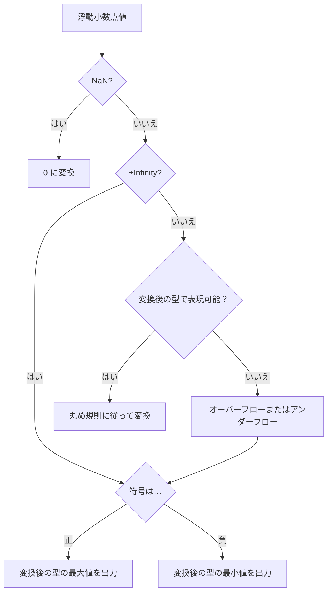

前回の続きです。前回はこちらから。

https://zenn.dev/peyang/articles/reading-jvm-chapter-02-7-8

このシリーズは，JVM の仕様書を読み解くためのガイドとして構成しています。
JVM の仕様書は非常に長大で難解な内容が多いため，各セクションごとに要点をまとめていきます。
また，JVM の内部構造や動作原理を知ることで，Java のパフォーマンスやセキュリティ，メモリ管理の仕組みを深く理解する試みです。

## 第二章 The Structure of the Java Virtual Machine

JVM の仕様書の第２章は「Java Virtual Machine の構造」です。
といいましてもこの章は全７章ある JVM の仕様書の中でも特に長く，また特に複雑な内容ですので，この記事では複数に分けて解説していきます。

ここでは Chapter 2.11 の内容を扱います。

### 2.11 命令セット概論（[› 2.11 Instruction Set Summary](https://docs.oracle.com/javase/specs/jvms/se24/html/jvms-2.html#jvms-2.11)）

JVM の命令は，実行する操作を指定する１バイトのオペコード（*opcode*）と，必要に応じて追加のオペランド(*operand*)を持ちます。
```bnf
instruction ::= opcode [operand]*
```

JVM のインタプリタの内部構造は次のように表現できます（例外を除く）：
```java
do {
  // 次の命令の位置を取得する
  currentPc = fetchNextPc();
  if (!currentPc) {
    break;  // 次の命令がない場合はループを抜ける
  }
  opcode = readNextOpcode(currentPc);
  switch (opcode) {
    // 命令を処理するケース
  }
} while (true);  // 無限ループ
```

### オペランドとバイトコードの格納

オペランドの数とサイズはオペコードごとに異なります。
オペランドのサイズが１バイトを超える場合は，ビッグエンディアン（*big-endian*）で格納されます。

例えば，ローカル変数への符号なし 16 ビット整数の値を格納する命令は，２つの符号なしバイト(byte1, byte2) として格納され，
その値は `byte1 << 8 | byte2` として計算されます。

バイト・コードの命令列は，基本的に１バイトで詰め込まれています。
つまり，各命令（オペコードとそのオペランド）は次の命令にバイト境界をあわせる必要はありません。
すなわち，以下のような命令も問題なくデコードできます：
```
0x10 0x05 0x3c 0x00
↑ bipush
     ↑ ローカル変数 5
          ↑ istore_1
               ↑ nop
```

:::message alert
ただし，`tableswitch` と `lookupswitch` 命令は例外です。

これらの命令は大量のデータ（ジャンプ・テーブル）を持つため，効率化のために**４バイト境界でアライメント**されて配置されます。
そのため，命令が始まるアドレスに応じて，0～3 バイトのパディング（`0x00) が挿入されることがあります。
:::

### 2.11.1 型と JVM の関係 ([› 2.11.1 Types and the Java Virtual Machine](https://docs.oracle.com/javase/specs/jvms/se24/html/jvms-2.html#jvms-2.11.1))

#### 命令と型の深い深い関係

JVM が対応するほとんどの命令には，（内部的には無いように見えても）型情報が埋め込まれています。
例えば `iload` 命令と `fload` 命令は，どちらもローカル変数から値をロードしますが，前者は `int` 型の値を，後者は `float` 型の値をロードします。
もしこの２つの内部的な実装が同一であっても，オペコードは異なるのです。

このように型に特化している命令は，以下の表のようにその名前に型情報が含まれている事が多いです。

| 接頭辞       | 説明                         |
|-----------|----------------------------|
| `b`       | 8ビット整数（`byte`）型を表す。        |
| `c`       | 16ビット文字（`char`）型を表す。       |
| `s`       | 16ビット整数（`short`）型を表す。      |
| `i`       | 32ビット整数（`int`）型を表す。        |
| `l`       | 64ビット整数（`long`）型を表す。       |
| `f`       | 32ビット浮動小数点数（`float`）型を表す。  |
| `d`       | 64ビット浮動小数点数（`double`）型を表す。 |
| `a`       | オブジェクト参照（`Object`）型を表す。    |

詳しくは第６章で解説します（暫しお待ち下さい）。

#### オペコードの限界とパフォーマンスのジレンマ

先ほど述べた通り，JVM のオペコードは 1 バイトで表現されます。
１バイトということは，オペコードの種類が計 2^8 = 256 種類を超えることはできません。

さらに前述の通り，例えば加算命令を１つとっても `add`(`iadd`, `ladd`, `fadd`, `dadd`) といったふうに，
型ごとに異なるオペコードが必要です。

そこで JVM は，一部に直交的な命令を用意して，**非直交的な命令を補完する戦略**を取りました。

直交的な命令というのは，`dup` や `swap` のように，**どの型に対しても同じ動作**をする命令です。
どの型に対しても同じ動作をするので，あらゆる型に対して同じオペコードを使用でき，オペコードの数を抑えられます。

一方で非直交的な命令は，**型ごとに異なる動作**をする命令です。
例えば `iadd` は `int` 型の値を加算しますが，`ladd` は `long` 型の値を加算します。
このような非直交的な命令を使用することで，VM の動作を効率化したのです。

ここで，非直交的な命令と直交的な命令を組み合わせることで，オペコードの数を抑えつつ，効率的な実行を実現しているのです。
さらに必要に応じて，その操作がある型と無い型とを変換するための命令（`d2i` や `i2d` など）を用意して，命令を網羅的にカバーしています。

例：
```
iload_0  ; int 型のローカル変数 0 をスタックにプッシュ
i2d      ; スタックの int 型の値を double 型に変換
dstore_1 ; スタックの double 型の値をローカル変数 1 に格納

dload_1 ; double 型のローカル変数 1 をスタックにプッシュ
dup     ; スタックの値を複製
dadd    ; スタックの２つの double 型の値を加算
...
```

このように，`dup` 命令はどの型に対しても同じ動作をする直交的な命令であり，
`i2d` 命令は `int` 型の値を `double` 型に変換する非直交的な命令です。
これらを組み合わせることで，異なる型の値を効率的に操作できます。

#### 型と命令の使い回し

ここで述べて於かなければならない事実があります。
それは，ほとんどの命令には整数型 `byte`, `char`, `short` 用の命令がないことです。
特に `boolean` 型用の命令は全く持って存在しません。

事実，`int` 型をローカル変数からスタックにプッシュする命令（`iload`）は有るのに対して，`byte` 型をローカル変数からスタックにプッシュする命令（`bload`のような）は存在しません。

これには少々深い理由がございます。
例えば `byte` 型や `short` 値がオペランド・スタックにプッシュされるたびに，内部では符号拡張によって暗黙的に `int` 型に変換されます。
同様に `boolean` 型と `char` 型の値がプッシュされるたびに，零拡張によって暗黙的に `int` 型に変換されます。

このように，JVM は `byte`, `char`, `short`, `boolean` 型の値を `int` 型に変換して処理するため，これらの型専用の命令は存在しなくてよいのです。
そのために，これらの型の値は `int` 型の操作をする命令によって正しく操作できるのです。

:::message
JVM がサポートしている非直交命令のリストについては，原文の [Table 2.11.1-A. Type support in the Java Virtual Machine instruction set](https://docs.oracle.com/javase/specs/jvms/se24/html/jvms-2.html#jvms-2.11.1-220:~:text=Table%C2%A02.11.1%2DA.%C2%A0Type%20support%20in%20the%20Java%20Virtual%20Machine%20instruction%20set) を参照してください。
:::

#### 型とカテゴリ

型にはカテゴリという概念があります。
これは型のサイズやメモリ上の配置に関する情報を示すものです。
JVM では型は次の２つのカテゴリに分類されます：
1. **カテゴリ 1**：`int`, `float`, `byte`, `char`, `short`, `boolean`, `reference`, `returnAddress` 型
   - これらの型は 32 ビット（4 バイト）で表現されます。
   - 例えば `int` 型の値は 4 バイトのメモリ領域を占有します。
2. **カテゴリ 2**：`long`, `double` 型
    - これらの型は 64 ビット（8 バイト）で表現されます。
    - 例えば `long` 型の値は 8 バイトのメモリ領域を占有します。

:::message
詳しい表については原文の [Table 2.11.1-B. Storage and Computational types in the Java Virtual Machine](https://docs.oracle.com/javase/specs/jvms/se24/html/jvms-2.html#jvms-2.11.1-220:~:text=Table%C2%A02.11.1%2DB.%C2%A0Storage%20and%20Computational%20types%20in%20the%20Java%20Virtual%20Machine) を参照してください。
:::

---

### 2.11.2 読み込みと保存に関連する命令（[› 2.11.2 Load and Store Instructions](https://docs.oracle.com/javase/specs/jvms/se24/html/jvms-2.html#jvms-2.11.2)）

これらの命令は，ローカル変数とオペランド・スタック間のデータの読み込みと保存を行います。

#### ローカル変数からの読み込み

ローカル変数から値を読み込む命令は，例えば次のようなものがあります：

| 命令      | 説明                                         |
|---------|--------------------------------------------|
| `iload` | `int` 型のローカル変数から値を読み込み，オペランド・スタックにプッシュします。 |
| `fload` | `float` 型で同様の操作をします。                       |
| `dload` | `double` 型で同様の操作をします。                      |
| `lload` | `long` 型で同様の操作をします。                        |
| `aload` | オブジェクト参照型で同様の操作をします。                       |

さらに，それぞれについて `_0`, `_1`, `_2`, `_3` の接尾辞を付けることで，ローカル変数のインデックスを直接指定できます。
例えば `iload_0` はローカル変数 0 から `int` 型の値を読み込みます。
これにより，ローカル変数のインデックスを指定するためのオペランドを省略でき，命令のサイズを小さくできます。

#### オペランド・スタックへの保存

ローカル変数に値を保存する命令は，次のようなものがあります：

| 命令       | 説明                                        |
|----------|-------------------------------------------|
| `istore` | オペランド・スタックから `int` 型の値を読み込み，ローカル変数に保存します。 |
| `fstore` | `float` 型で同様の操作をします。                      |
| `dstore` | `double` 型で同様の操作をします。                     |
| `lstore` | `long` 型で同様の操作をします。                       |
| `astore` | オブジェクト参照型で同様の操作をしす。                       |

これも同様に，それぞれについて `_0`, `_1`, `_2`, `_3` の接尾辞を付けて直接ローカル変数のインデックスを指定できます。

#### ローカル変数番号の拡張

ローカル変数を扱う命令（上記のものと `iinc`, `ret`）は，ローカル変数のインデックスを 0 ～ 255 の範囲で指定します。
これはオペランドを 1 バイトで表現するためです。

しかし，ローカル変数のインデックスが 255 を超える場合があるかも分かりません。
そのような場合には `wide` 命令を使用することで，オペランドを 2 バイトで表現します。
そうすることによってローカル変数のインデックスを 0 ～ 65535 の範囲で指定できます。

例：
```
iload 9999  // これは無効な命令です。
wide iload 9999  // そのため， wide 命令を使って 2 バイトでインデックスを指定します。
```

#### スタックへの定数のプッシュ

定数を無からオペランド・スタックにプッシュする命令は，次のようなものがあります：

| 命令           | 説明                                 |
|--------------|------------------------------------|
| `bipush`     | 8 ビットの符号付き整数をオペランド・スタックにプッシュします。   |
| `sipush`     | 16 ビットの符号付き整数を扱います。                |
| `ldc`        | 定数プールから値を読み込みます。                   |
| `ldc_w`      | 16 ビットのインデックスを使用して定数プールから値を読み込みます。 |
| `ldc2_w`     | 64 ビットのインデックスを使用して定数プールから値を読み込みます。 |
| `iconst_<i>` | `int` 型の定数をオペランド・スタックにプッシュします。     |
| `fconst_<f>` | `float` 型の定数をオペランド・スタックにプッシュします。   |
| `dconst_<d>` | `double` 型の定数をオペランド・スタックにプッシュします。  |
| `lconst_<l>` | `long` 型の定数をオペランド・スタックにプッシュします。    |

このとき…

+ `<i>` は `m1`, `0`, `1`, `2`, `3` のいずれかで，`iconst_m1`, `iconst_0` …のように記述します。  
  なお, `iconst_m1` は `-1` を表します。
+ `<f>` は `0`, `1`, `2` のいずれかです。
+ `<d>` は `0`, `1` のいずれかです。
+ `<l>` は `0`, `1` のいずれかです。

### 2.11.3 算術演算に関する命令（[› 2.11.3 Arithmetic Instructions](https://docs.oracle.com/javase/specs/jvms/se24/html/jvms-2.html#jvms-2.11.3)）

算術命令は，（通常は）オペランド・スタックのトップにある２つの値を操作し，結果をオペランド・スタックにプッシュします。

これらは整数値を扱う命令と浮動小数点値を扱う命令に分かれます。
特に，浮動小数点値を使う命令は， IEEE 754 規格には**厳格には準拠していません**
（参考：[JVM を読む | JVM の構造その４ - オブジェクトの表現と浮動小数点数の計算について](https://zenn.dev/peyang/articles/reading-jvm-chapter-02-7-8#2.8-%E6%B5%AE%E5%8B%95%E5%B0%8F%E6%95%B0%E7%82%B9%E6%95%B0%E3%81%AE%E8%A8%88%E7%AE%97%EF%BC%88%E2%80%BA-2.8-floating-point-arithmetic%EF%BC%89)）。

命令は次のように分類されます：

| 命令      | int 型                   | long 型                  | float 型          | double 型         |
|---------|-------------------------|-------------------------|------------------|------------------|
| 加算      | `iadd`                  | `ladd`                  | `fadd`           | `dadd`           |
| 減算      | `isub`                  | `lsub`                  | `fsub`           | `dsub`           |
| 乗算      | `imul`                  | `lmul`                  | `fmul`           | `dmul`           |
| 除算      | `idiv`                  | `ldiv`                  | `fdiv`           | `ddiv`           |
| 剰余      | `irem`                  | `lrem`                  | `frem`           | `drem`           |
| 否定      | `ineg`                  | `lneg`                  | `fneg`           | `dneg`           |
| ビットシフト  | `ishl`, `ishr`, `iushr` | `lshl`, `lshr`, `lushr` |                  |                  |
| 論理積     | `iand`                  | `land`                  |                  |                  |
| 論理和     | `ior`                   | `lor`                   |                  |                  |
| 排他的論理和  | `ixor`                  | `lxor`                  |                  |                  |
| インクリメント | `iinc`                  |                         |                  |                  |
| 比較      |                         |                         | `fcmpl`, `fcmpg` | `dcmpl`, `dcmpg` |

:::message alert
JVM は整数演算中のオーバ・フローを**検出しません**。

例外をスローする可能性のある命令は，整数乗算命令（`idiv`, `ldiv`）と整数剰余命令（`irem`, `lrem`）のみで， これらの命令は除数が `0` の場合に `java.lang.ArithmeticException` をスローします。
:::

:::message alert
JVM は浮動小数点演算中のオーバ・フローやアンダ・フローを**検出しません**し，例外もスローしません。

オーバ・フローが発生する場合には，`Infinity`（正の無限大）または `-Infinity`（負の無限大）を返します。
一方で，アンダ・フローが発生する場合には，`NaN`（非数）または符号付きの `0.0` を返します。

オペランドとして `NaN`（非数）を使用した場合，どのような命令であっても結果も `NaN` になります。
:::

### 2.11.4. 型変換に関する命令（[› 2.11.4 Type Conversion Instructions](https://docs.oracle.com/javase/specs/jvms/se24/html/jvms-2.html#jvms-2.11.4)）

JVM は，異なる型間の変換を行うための命令を提供しています。
これは，プログラマがコード内で明示的に型変換をしたり，JVM 命令セットの非直交的な部分を補ったりするために使えます。

#### 拡張変換

JVM は，次のような値を拡張するための命令を提供しています：

| 命令    | 説明                             |
|-------|--------------------------------|
| `i2l` | `int` 型の値を `long` 型に変換します。     |
| `i2f` | `int` 型の値を `float` 型に変換します。    |
| `i2d` | `int` 型の 値を `double` 型に変換します。  |
| `l2i` | `long` 型の値を `int` 型に変換します。     |
| `l2f` | `long` 型の値を `float` 型に変換します。   |
| `l2d` | `long` 型の値を `double` 型に変換します。  |
| `f2d` | `float` 型の値を `double` 型に変換します。 |

この `x2y` の形式は，`x` 型の値を `y` 型に変換することを意味します（ちなみに `2` は「to」の意味です）。

ほとんどの拡大変換では，絶対値が変わらないように変換されます。
事実，`int` → `long` の変換や， `int` → `double` の変換では，数値の値はそのままコピーされます。
さらに `float` → `double` の変換では，浮動小数点数の値もそのままコピーされます。

**浮動小数点数値の変換について**

:::message alert
`int` → `float` や `long` → `float`，或いは `long` → `double` の変換では，精度が悪くなる可能性があります。
値の最下位ビットの一部が脱落する可能性があります（例外がスローされることはありません）。

このような場合には，*Rounding Policy*（丸め規則）に従って，値が丸められます。
参考：[JVM を読む | JVM の構造その４ - オブジェクトの表現と浮動小数点数の計算について： 浮動小数点数の丸め処理（Rounding Policy）](https://zenn.dev/peyang/articles/reading-jvm-chapter-02-7-8#%E6%B5%AE%E5%8B%95%E5%B0%8F%E6%95%B0%E7%82%B9%E6%95%B0%E3%81%AE%E4%B8%B8%E3%82%81%E5%87%A6%E7%90%86%EF%BC%88rounding-policy%EF%BC%89)
:::

**整数値の変換について**

`int` → `long` の変換は， `int` 型の値の２の歩数表現をそのまま `long` 型にコピーしたうえで，0 を左側に埋めます。
さらに `char` を変換する場合には，同じく `char` 型の値の２の歩数表現をそのまま `int` 型にコピーしたうえで，0 を左側に埋めます。

:::message
整数型 `byte` や `char`, 或いは `short` の値を `int` 型に変換する命令はありません。
なぜならこれらは内部で暗黙的に `int` 型に変換されるからです。
:::

#### 縮小変換

JVM は，次のような値を縮小するための命令を提供しています：
| 命令    | 説明                             |
|-------|--------------------------------|
| `i2b` | `int` 型の値を `byte` 型に変換します。     |
| `i2c` | `int` 型の値を `char` 型に変換します。     |
| `i2s` | `int` 型の値を `short` 型に変換します。    |
| `l2i` | `long` 型の値を `int` 型に変換します。     |
| `f2i` | `float` 型の値を `int` 型に変換します。    |
| `d2i` | `double` 型の値を `int` 型に変換します。  |
| `d2l` | `double` 型の値を `long` 型に変換します。  |
| `d2f` | `double` 型の値を `float` 型に変換します。 |

:::message alert
数値の縮小変換では精度が悪化して，符号や桁数，或いはその両方が失われるかもしれません。

例えば `int` や `long` の値を縮小変換する場合には，収まりきらないビットは全て切り捨てられます。
そのため，入力値と出力値の間に大幅な差異が生じる可能性があります。
:::

**浮動小数点数値の変換について**

浮動小数点値を整数型（`int`, `long`）に変換する場合は，値は次のように丸められます：

1. 浮動小数点が `NaN`（非数）である場合は，`0` に変換されます。
2. 浮動小数点が `±Infinity`ではない場合に，かつ変換後の型で表現できる場合は，（丸め規則に従って）その値に丸められます。
3. 浮動小数点が `±Infinity` の場合は，符号に応じてそれぞれの型の最大値または最小値に変換されます。



## まとめ

JVM の命令セットは，オペコードとオペランドを組み合わせて構成されます。
命令は型に特化しており，直交的な命令と非直交的な命令を組み合わせることで，効率的な実行を実現しています。

型はカテゴリに分類され，命令はそれぞれの型に対して異なる動作をします。
また，ローカル変数とオペランド・スタック間のデータの読み込みと保存を行う命令があり，定数をオペランド・スタックにプッシュする命令も存在します。
算術演算に関する命令は，整数値と浮動小数点値に分かれ，型変換に関する命令も提供されています。

次回は，JVM の命令セットの解説の続きとして，オブジェクトの生成やフロー制御に関する命令について解説します。

では，よいバイト・コードライフを！
