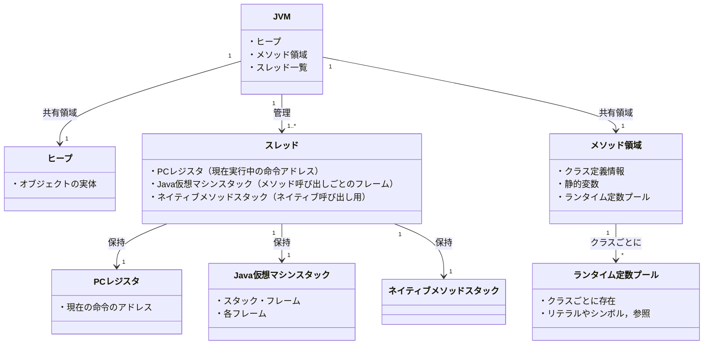

前回の続きです。前回はこちらから。

https://zenn.dev/peyang/articles/reading-jvm-chapter-02-1-4 

このシリーズは，JVM の仕様書を読み解くためのガイドとして構成しています。
JVM の仕様書は非常に長大で難解な内容が多いため，各セクションごとに要点をまとめていきます。
また，JVM の内部構造や動作原理を知ることで，Java のパフォーマンスやセキュリティ，メモリ管理の仕組みを深く理解する試みです。

## 第二章 The Structure of the Java Virtual Machine

JVM の仕様書の第２章は「Java Virtual Machine の構造」です。
といいましてもこの章は全７章ある JVM の仕様書の中でも特に長く，また特に複雑な内容ですので，この記事では複数に分けて解説していきます。

ここでは Chapter 2.5 の内容（ランタイム時のデータ領域）を扱います。

## 2.5 ランタイム時のデータ領域（[› 2.5 Runtime Data Areas](https://docs.oracle.com/javase/specs/jvms/se24/html/jvms-2.html#jvms-2.5)）

JVM は実行時にさまざまなデータ領域にアクセスします。
データ領域はその性質によって次のように分類されます：

+ **JVM 全体**に存在するもの：JVM の起動時に割り当てられ，プログラムの実行中に共有されます。
  - ヒープ
  - メソッド領域
  - ランタイム定数プール
+ **スレッドごと**に存在するもの：スレッドの作成時に割り当てられ，スレッドの終了時に解放されます。
  - `pc` レジスタ
  - JVM スタック
  - ネイティブ・メソッド・スタック
+ **クラスごと**に存在するもの：クラスがロードされるときに割り当てられ，クラスのアンロード時に解放されます。
  - ランタイム定数プール
  - クラスのメタデータ
  - クラスのフィールドやメソッドの情報
  - 静的変数など

これらのデータ領域は、JVM の実行時に必要な情報を格納し、プログラムの実行をサポートします。

### `pc` レジスタ（スレッドごと）

JVM は，現在実行中の命令の位置を示す `pc`（Program Counter）レジスタを持ちます。
`pc` レジスタは現在実行中の命令の位置を追跡するためのものであり，各スレッドごとに１つ存在します。

各スレッドは，どの瞬間においても（或るメソッド内の）１つの命令を実行しています。
そのメソッドが `native` メソッドでない限りは，その命令のアドレスは `pc` レジスタによって指し示されます。
（`native` メソッドは JVM の外部で実行されるため、`pc` レジスタは使用されません。その場合は `undefined` です。）

### JVM スタック（スレッドごと）

JVM は，JVM スタックを各スレッドごとに１つ持ちます。

これは[フレーム](reading-jvm-chapter-02-6.md)と呼ばれるデータ構造を格納するスタックです。
フレームとは，メソッドの実行に必要な情報を保持するためのデータ構造であり， 例えばローカル変数，オペランドスタック，動的リンク，およびメソッドの引数などが含まれます。

フレームはメソッドが呼び出されるたびにスタックにプッシュされて，メソッドの実行が終了するとスタックからポップされます。

:::message
JVM 仕様では，スタックのサイズを明示的に指定していません。
すなわち，固定サイズにすることも，必要に応じて拡張することもできます。
（スタックのサイズは JVM の実装によって異なるため、スタックオーバーフローが発生する可能性があります。）
:::

### ヒープ（JVM 全体）

JVM は，すべてのスレッドで共有されるヒープ領域を持ちます。
ヒープ領域とは，総てのクラス・インスタンスと配列の実体が割り当てられる領域です。

ヒープは JVM の起動時に作成され、プログラムの実行中に動的に拡張されることがあります。
オブジェクト用のヒープストレージは自動的に管理され，要素の割り当てと解放は**ガーベジ・コレクション・システム**によって行われます。
ガベージ・コレクション（GC）とは，不要なオブジェクトを自動的に検出し，解放する仕組みです。
ガベージ・コレクタという特別なコンポーネントがこの役割を担います。

:::message
JVM 仕様では，ガベージ・コレクタの具体的な実装やアルゴリズムの定義は行われていません。
また，ヒープのサイズの制限もありませんし，ヒープ用のメモリが連続している必要もありません（メモリ配置が離散的であってもよい）。

ただし，使用できるヒープサイズ以上のヒープを必要とする場合， JVM は `OutOfMemoryError` をスローします。
:::

### メソッド領域（JVM 全体）

JVM は，すべてのスレッドで共有されるメソッド領域を持ちます。
メソッド領域は，ランタイム定数プール，フィールドおよびメソッドのデータ，およびクラスのメタデータ及び構造データなどの情報を格納します。

メソッド領域は JVM の起動時に作成されます。
さらにこれは（理論的には）ヒープ領域の一部で，或る単純な実装ではガベージ・コレクションも行わなくてもよいとされています。
（なぜなら，クラスの構造やメタデータ，メソッドの定義は通常，プログラムの実行中に変更されない上に，明示的にアンロードされることもないからです。）

:::message
JVM 仕様では，メソッド領域のサイズを明示的に指定していません。
また，使用できるメソッド領域サイズ以上のメタデータを必要とする場合、JVM は `OutOfMemoryError` をスローします。
:::

### ランタイム定数プール（クラスごと）

各クラスは、ランタイム定数プールと呼ばれるデータ構造を持ちます。
これはクラスファイルの `constant_pool` テーブル（後述）の値をクラスごと，またはインタフェースごとに格納するための領域です。
コンパイル時に定義されたリテラルや，実行時に解決する必要のあるメソッドやフィールドの参照まで，いろいろな定数が格納されます。

ランタイム定数プールには，他のプログラミング言語のシンボル・テーブルと似たような役割がありますが，
JVM ではそれよりもはるかに多くの情報を格納します。

各ランタイム定数プールは，JVM の[メソッド領域](#メソッド領域jvm-全体)内に割り当てられます。
さらに，ランタイム定数プールは，JVM によってクラスまたはインタフェースがロードされるときに構築されます。

なお，これも同様に使用できるランタイム定数プールのサイズ以上の定数を必要とする場合、JVM は `OutOfMemoryError` をスローします。

### ネイティブ・メソッド・スタック（スレッドごと）

JVM は，ネイティブ・メソッドを実行するためのネイティブ・メソッド・スタックを持ちます。

ネイティブ・メソッドとは、Java 言語以外の言語（C や C++ など）で実装されたメソッドのことです。
JVM はこれを呼び出すために，従来の C 言語のスタックを使用します。

或る JVM の実装で，それがネイティブ・メソッド・スタックを使用しない場合（そもそも呼び出せない，または自分自身が従来のスタックに依存しない場合）にはこれを実装する必要はありません。

なお，許容できるよりもより多くのネイティブ・メソッド・スタックを必要とする場合は，`StackOverflowError` をスローします。
またこの拡張を試みて，それにも失敗した場合は，`OutOfMemoryError` をスローします。

### 図にすると…

## まとめ

いかがでしたか？
JVM のランタイム時のデータ領域は，プログラムの実行に必要な情報を格納するための重要なコンポーネントです。
これらのデータ領域は、JVM の動作を理解する上で非常に重要です。
次回は Chapter 2.6 の内容（フレーム）を扱います。

では，よいバイト・コードライフを！

#### 次回リンク

https://zenn.dev/peyang/articles/reading-jvm-chapter-02-6
