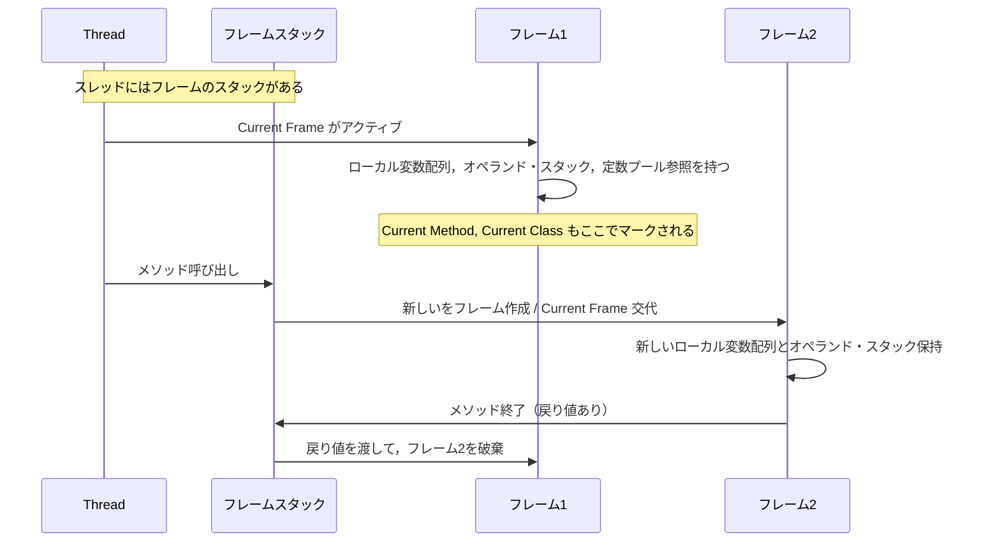
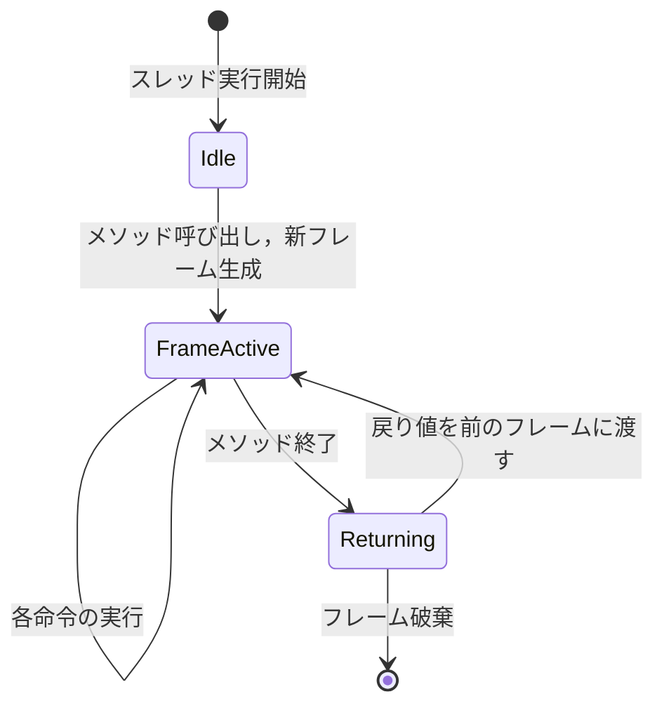
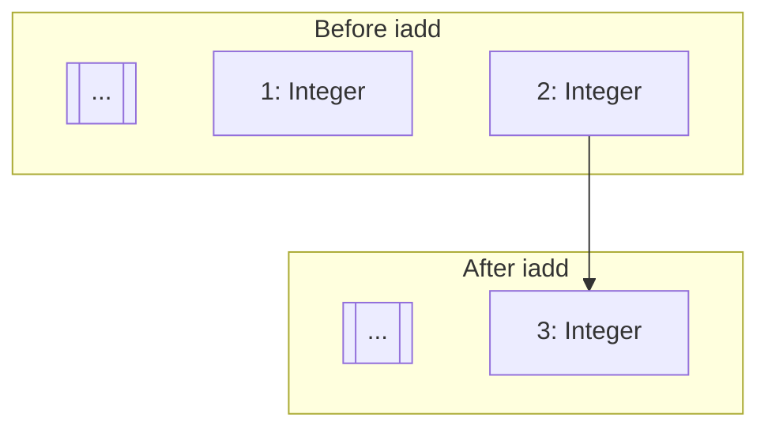
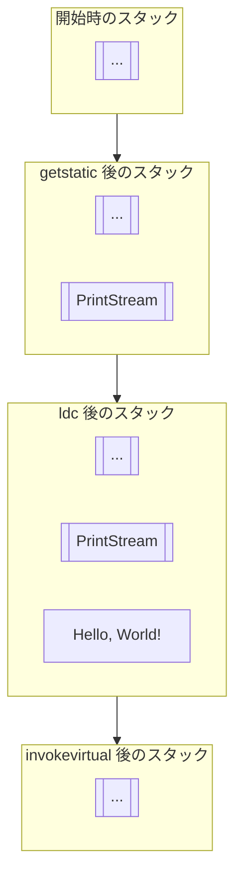
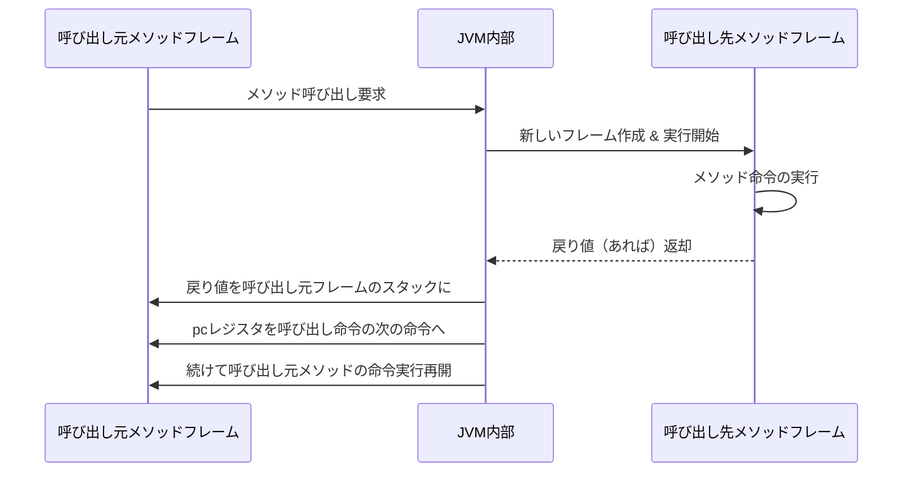
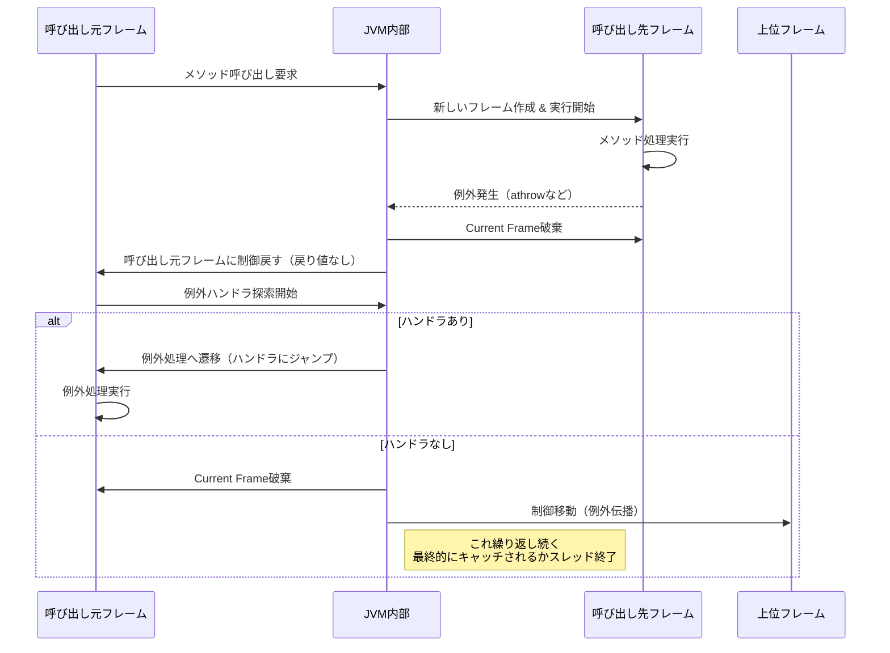

前回の続きです。前回はこちらから。

https://zenn.dev/peyang/articles/reading-jvm-chapter-02-5

このシリーズは，JVM の仕様書を読み解くためのガイドとして構成しています。
JVM の仕様書は非常に長大で難解な内容が多いため，各セクションごとに要点をまとめていきます。
また，JVM の内部構造や動作原理を知ることで，Java のパフォーマンスやセキュリティ，メモリ管理の仕組みを深く理解する試みです。

シリーズはこちらから。

https://zenn.dev/peyang/articles/reading-jvm-chapter-00

## 第二章 The Structure of the Java Virtual Machine

JVM の仕様書の第２章は「Java Virtual Machine の構造」です。
といいましてもこの章は全７章ある JVM の仕様書の中でも特に長く，また特に複雑な内容ですので，全８回に分けて解説していきます。

ここでは Chapter 2.6 の内容（フレーム）を扱います。

## 2.6 フレーム（[› 2.6 Frames](https://docs.oracle.com/javase/specs/jvms/se24/html/jvms-2.html#jvms-2.6)）

フレームとは，データや状態，動的リンク，メソッドの戻り値などを保持する，および例外の処理を行うためのデータ構造です。
簡単に言うと，メソッドを実行するために必要な情報を格納するコンテナです。

フレームは，JVMがメソッドを呼び出す際に作成され，メソッドの実行中に必要な情報を保持します。
フレームはスタック上に積まれ，メソッドの呼び出しと戻りに伴ってプッシュおよびポップされます。
メソッドの実行が正常に終了しても，（例外が発生して）異常終了したとしても，例外なくフレームはスタックから取り除かれて破棄されます。

例：
```
; main() が呼ばれた！   
+------------+
|  フレーム1  | ← main()
+============+

-=-=-=-=-=-=-=-=-=-=-

; doStuff() が呼ばれた！
+------------+
|  フレーム2  | ← doStuff()
+------------+
|  フレーム1  | ← がmain()
+============+

-=-=-=-=-=-=-=-=-=-=-

; doStuff() が終了！main() に戻る！
+------------+
|  フレーム1  | ← main()
+============+
```

### フレームの中身と制約

各フレームは，ローカル変数の配列やオペランド・スタック，現在のメソッドの実行時定数テーブル（への参照）を持ちます。
なお，或る JVM 実装によっては，デバッグ情報などの追加の情報を持つ場合があります。

各スレッドでは，１つのフレームのみがアクティブ（或るスレッドが実行しているコードは常に１つのメソッドの１つの命令だから）であり，名をば「Current Frame」と呼びます。
さらに，そのアクティブなメソッドのことを「Current Method」，そのメソッドを持つクラスを「Current Class」と呼びます。
ローカル変数とオペランド・スタックに対する操作は，通常は Current Frame に対して行われます。

フレームは，その Current Method が別のメソッド呼び出したり，またはそのメソッドから抜けると Current ではなくなります。
また，或るメソッドが呼び出されるとき，新しいフレームが作成されて新しいメソッドに制御が移ると，それぞれ Current Frame や Current Method として扱われます。

メソッドから抜けると，（戻り値があるならば）前のフレームに戻り値が渡されて，さらにそのフレームが Current Frame になります。
なお抜ける前のフレームは，その時に破棄されます。

バイト・コードを生成するコンパイラは，メソッドのコードに基づいて各フレームのローカル変数配列とオペランド・スタックのサイズを計算し，バイト・コード内にそれを埋め込みます。
前者は，**メソッド内のコードが使用するローカル変数の最大数**に基づいて決定され，後者は**オペランド・スタックの最大要素数**に基づいて決定されます。
これによって，JVM がコードを実行する際に，予期しないオペランド・スタックのオーバーフローやローカル変数の不足が発生しないようにします。

:::message alert
各スレッドの持つフレームは，他のスレッドからは参照できません。
:::

### フレームの状態遷移





## 2.6.1 ローカル変数（[› 2.6.1 Local Variables](https://docs.oracle.com/javase/specs/jvms/se24/html/jvms-2.html#jvms-2.6.1)）

各フレームには専用の**ローカル変数の配列**があり，これにはメソッドの引数やローカル変数を格納します。  
ローカル変数のアドレスはインデックスで指定され，最初の要素はインデックス 0 から始まります。

:::message
いつも Java を書いているときには，ローカル変数がどのように管理されているかを 意識することはあまりありません。
ローカル変数は名前で参照することから，`HashMap` のような連想配列で管理されているように思えるかもしれません。

しかしながら，Java 仮想マシンの仕様書によると，ローカル変数は配列で管理されており，インデックスで参照されることが明記されています。
:::

この配列は，フレームの作成時にサイズが決定されます（これは前述の通りコンパイル時に計算されてコードに埋め込まれます）。このサイズは，実行時に縮小したり拡張したりすることはできません。
配列の各要素は，それ１つで`integer` 型，`float` 型，参照型，または `returnAddress` 型のいずれかの型を持ちます。
もしくは２つの連続した要素を組み合わせて `long` 型や `double` 型の値を表現します。

### ローカル変数配列における long/double 型の扱い

long 型または double 型の値は，ローカル変数配列では２つの連続した要素を使用して表現されます。 
`slot N` にその値の下位 32 ビットが格納され，`slot N+1` に上位 32 ビットが格納されます。

例えば，`slot 0` に `long` 型の値 `0x0123456789ABCDEF` を格納する場合は，次のようになります。

```
+------------+------------+
|   slot 0   |   slot 1   |
+------------+------------+
| 0x89ABCDEF | 0x01234567 |
+------------+------------+
```

:::message alert
このとき，２つ目のインデックス番号でこの `long` 型や `double` 型の値を参照することはできません。
この場合では`slot 0` のみが有効なインデックスであり，`slot 1` を用いてこの値を参照することはできません。
:::

なお，２つの連続した要素を使用する場合に，その最初の要素のインデックスが**必ずしも偶数である必要はありません**。
`integer` 型の値を `slot 0` に格納し，その後に `long` 型の値を `slot 1` と `slot 2` に格納しても，問題ありません。


### メソッド引数の受け渡し

JVM はメソッドの引数をローカル変数として扱います。JVM がメソッドを呼び出すとき，呼び出し元のメソッドから引数の値がローカル変数配列にコピーされます。

引数の数はメソッドの定義に基づいて決まります。
静的メソッドを呼び出す場合には，引数はローカル変数配列の `0` から始まるインデックスに格納されます。
引数の型に応じて，ローカル変数配列の要素は適切な型で格納されます。

さらに，インスタンス・メソッドを呼び出す場合には，ローカル変数 `0` にそのインスタンスの参照（Java で言うところの `this`）がローカル変数として格納されます。
その後パラメータの値は，ローカル変数配列の `1` から始まるインデックスに格納されます。

```
; インスタンスメソッドの引数が 3 つある場合
public void exampleMethod(int a, String b, double c) {
    // ローカル変数配列の状態
    +------------+------------+------------+------------+------------+
    |   slot 0   |   slot 1   |   slot 2   |   slot 3   |   slot 4   |
    +============+============+============+============+============+
    | this (ref) | a (int)    | b (String) | c (double) | (double2)  |
    +------------+------------+------------+------------+------------+
}

; 静的メソッドの引数が 2 つある場合
public static void exampleStaticMethod(int x, int y) {
    // ローカル変数配列の状態
    +------------+------------+
    |   slot 0   |   slot 1   |
    +============+============+
    | x (int)    | y (int)    |
    +------------+------------+
}

```

## 2.6.2 オペランド・スタック（[› 2.6.2 Operand Stack](https://docs.oracle.com/javase/specs/jvms/se24/html/jvms-2.html#jvms-2.6.2)）

各フレームは，オペランド・スタックという独自の LIFO（先入れ先出し）スタックを持ちます。
これはメソッドの実行中に，各命令が使用する一時的なデータを格納するためのものです。これもローカル変数配列と同様に，フレームの作成時にサイズが決定されます（そしてこれもコンパイル時に計算されて，コードに埋め込まれます）。
なお，オペランド・スタックは（ローカル変数とは違って）フレームの作成時は空の状態です。

JVM は，ローカル変数やフィールド，定数や値をオペランド・スタックにプッシュする命令を提供します（`iload`, `fload`, `getfield` など）。
また一方でオペランド・スタックから値を取り出して，操作して結果をオペランド・スタックにプッシュする命令もあります（`iadd`, `fsub`, `invokevirtual` など）。
さらに，オペランド・スタックは，メソッドに渡すパラメータを準備したり，メソッドの結果を受け取るために使用されます。

### オペランド・スタックの操作

例えば，`iadd` 命令は２つの `int` 型の値を加算します。
この命令は加算する２つの `int` 値をオペランド・スタックの最上位から取り出します。 取り出す値は，前の何らかの命令（`iconst`, `iload` など）でオペランド・スタックの最上位にプッシュされた値です。
これらの値を加算して，その結果をオペランド・スタックの最上位にプッシュします。

例えば，以下のコードを考えてみましょう。

```java
int x = 1 + 1;
```

これをバイト・コードにコンパイルすると，以下のようになります。

```
iconst_1   // オペランド・スタックに 1 をプッシュ
iconst_2   // オペランド・スタックに 2 をプッシュ
iadd       // オペランド・スタックから 1 と 2 を取り出して加算し，結果 3 をプッシュ
istore_0   // オペランド・スタックから 3 を取り出してローカル変数配列の slot 0 に格納
```



#### `System.out.println("Hello, World!")` の例：

次に，もう少し複雑な例として，以下のコードを考えてみましょう。

```java
System.out.println("Hello, World!");
```

このコードをバイト・コードにコンパイルすると，以下のようになります。

```java
// オペランド・スタックに PrintStream をプッシュする
getstatic java/lang/System->out:Ljava/io/PrintStream;

// オペランド・スタックに文字列をプッシュする
ldc "Hello, World!"

//  オペランド・スタックから PrintStream と文字列を取り出して println を呼び出す
invokevirtual java/io/PrintStream->println(Ljava/lang/String;)V
```



### オペランド・スタックの制約

オペランド・スタックの各要素には，`long` 型や `double` 型などを含む，JVM のあらゆる型の値を格納できます。

:::message alert
オペランド・スタックはその型に適した命令で操作される必要があります。
例えば，オペランド・スタックにある２つの `float` 型の値を，`int` 型の命令を加算する命令である `iadd` 命令で加算しようとすると，`VerifyError` が発生します。
:::

いくつかの命令は，型に一切関係なくオペランド・スタックの値を操作できます。（`swap` や `dup` など）
ただし，`long` 型や `double` 型の連続した値を破壊するような命令の使い方をすると `VerifyError` が発生します。

各命令には寄与するオペランド・スタックの要素数が決まっており，命令の実行前にオペランド・スタックに十分な要素があることを確認する必要があります。
例えば dup 命令は，オペランド・スタックの最上位の値を複製しますが，`long` 型や `double` 型の値は２つの連続した要素で表現されるため，そのままでは複製できません。
この場合には代わりに `dup2` 命令を使用して，これら２つの要素を同時に複製できます。

## 2.6.3 動的リンク （[› 2.6.3 Dynamic Linking](https://docs.oracle.com/javase/specs/jvms/se24/html/jvms-2.html#jvms-2.6.3)）

各フレームには，メソッド・コードの実行に必要な実行時定数プール（への参照）が含まれます。
この定数プールは，メソッドの実行中に使用されるクラスやメソッド，フィールド，およびその他の定数を格納します。
動的リンクは，メソッドの実行中に必要なクラスやメソッドを解決するために使用されます。

動的リンクは，定数プールでシンボルとして指定されているクラスやメソッド，フィールドを動的に解決し，その参照を取得します。
未定義のシンボルは必要に応じてロードされ，またフィールドへのアクセスを実効上のフィールド参照（オフセット）に変換されます。

:::message
このように，メッセージと変数を遅延的に解決することで，JVM はクラスのロードやリンクを効率的に行っています。
またメソッドが使用する他のクラスに変更を加えた場合でも，動的リンクにより柔軟に対応できます。
:::

## 2.6.4 メソッド呼び出しの正常終了 （[› 2.6.4 Normal Method Invocation Completion](https://docs.oracle.com/javase/specs/jvms/se24/html/jvms-2.html#jvms-2.6.4)）

メソッド呼び出しが，（JVM から，もしくは `athrow` 命令によって）例外が発生せずに正常に完了した場合は，メソッド呼び出しが正常に完了したとみなされます。

そのときは，呼び出し元のメソッドに戻り値が返されることがあります。
さらに Current Frame は，呼び出し元の状態を復元するために使われ，呼び出し元の `pc` レジスタ（プログラムカウンタ）は，そのメソッド呼び出しを行った命令の次の命令に設定されます。
その後，呼び出し元のメソッドのフレームで，（戻り値があればば設定されて）通常の命令の実行が再開されます。

:::message alert
戻り値は呼び出したメソッドが `return` 軽命令(`ireturn`, `areturn` など) 命令を使用して返す場合に限られます。

なお，各 `return` 系命令は，そのメソッドが定義する戻り値の型と一致する必要があります。
例えば `int` 型の戻り値を持つメソッドで `freturn`(float 型を返す) 命令を使用すると，`VerifyError` が発生します。
:::



## 2.6.5 メソッド呼び出しの異常終了 （[› 2.6.5 Abnormal Method Invocation Completion](https://docs.oracle.com/javase/specs/jvms/se24/html/jvms-2.html#jvms-2.6.5)）

メソッド呼び出しが異常終了した場合は，呼び出し元のフレームに戻ることなく例外処理が行われます。
これは JVM がエラーを投げたり，呼び出し先のメソッドが `athrow` 命令を使用して例外を投げた場合に発生します。

その例外が Current Method 内でキャッチできない場合は，メソッド呼び出しを即座に終了します。
その間は，呼び出し元に値を返すことなく，Current Frame を破棄して呼び出し元のフレームに制御を戻します。

### ぺやんぐ脚注

その後，呼び出し元のフレームは，例外を処理するための適切なハンドラを探します。
もし呼び出し元のフレームでも例外がキャッチできない場合は，さらに上位のフレームに制御が移ります。
最終的に，例外がキャッチされるかスレッドが終了するまでこのプロセスは続きます。



（脚注終わり）

## まとめ

いかがでしたか？
この記事では，JVM のフレームについて解説しました。
フレームはメソッドの実行に必要な情報を保持し，ローカル変数やオペランド・スタックを管理します。
また，フレームはメソッドの呼び出しと戻りを制御し，動的リンクを通じてクラスやメソッドの参照を解決します。

フレームの理解は，JVM の動作やメソッドの実行の仕組みを深く理解するために重要です。
次回は Chapter 2.7, 2.8 の内容を扱います（比較的軽い内容です）。
では，よいバイト・コードライフを！

#### 次回リンク

https://zenn.dev/peyang/articles/reading-jvm-chapter-02-7-8

#### 参考文献＆リンク集

+ Lindholm, T., Yellin, F., Bracha, G., & Smith, W. M. D. (2025). [*The Java® Virtual Machine Specification: Java SE 24 Edition*](https://docs.oracle.com/javase/specs/jvms/se24/html/).
+ Lindholm, T., & Yellin, F. (1999). *The Java™ Virtual Machine Specification* (2nd ed.). Addison-Wesley. ISBN 978-0-201-43294-7
+ Otavio, S. (2024). *Mastering the Java Virtual Machine*.  Packet Publishing. ISBN 978-1-835-46796-1
