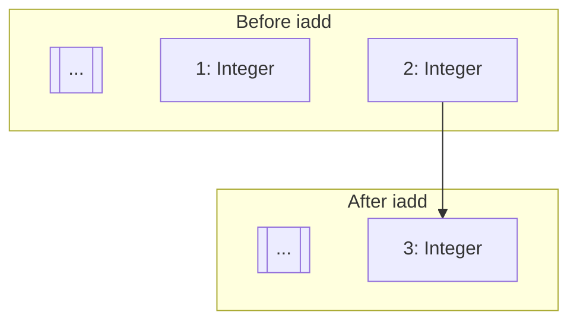
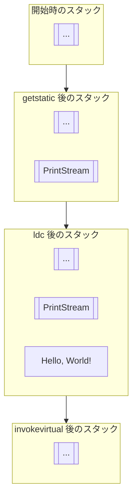
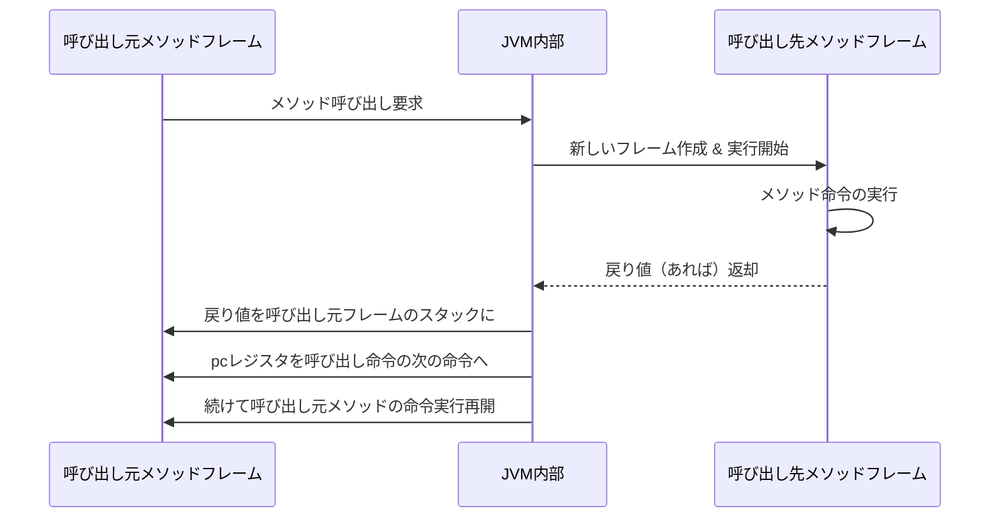
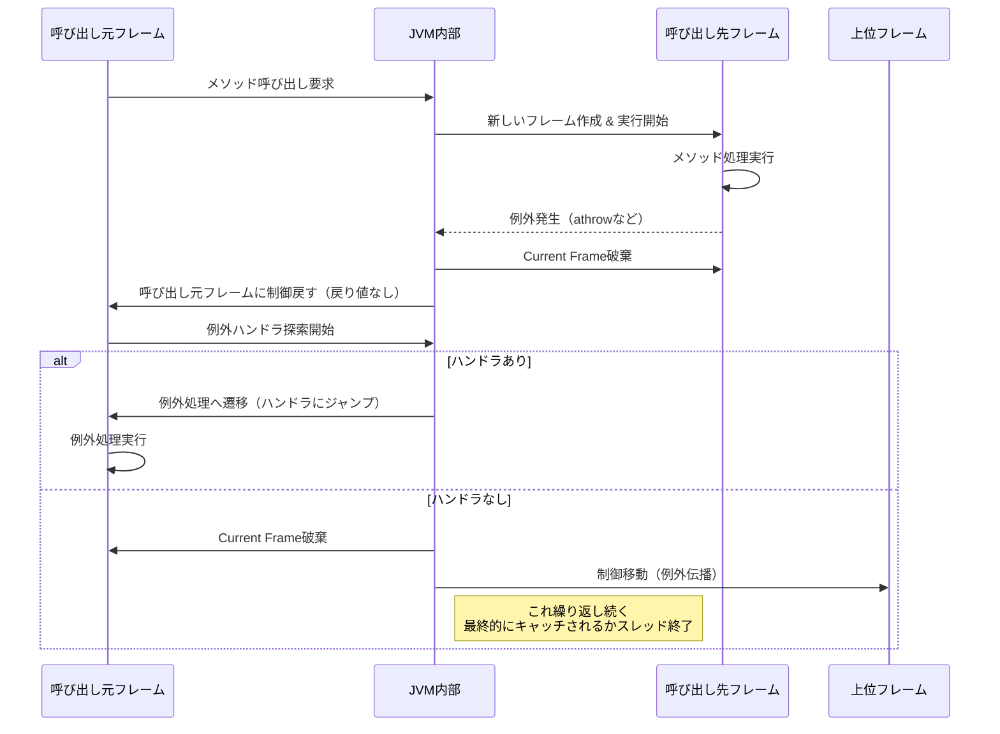

前回の続きです。前回はこちらから。

https://zenn.dev/peyang/articles/reading-jvm-chapter-02-5

このシリーズは，JVM の仕様書を読み解くためのガイドとして構成しています。
JVM の仕様書は非常に長大で難解な内容が多いため，各セクションごとに要点をまとめていきます。
また，JVM の内部構造や動作原理を知ることで，Java のパフォーマンスやセキュリティ，メモリ管理の仕組みを深く理解する試みです。

シリーズはこちらから。

https://zenn.dev/peyang/articles/reading-jvm-chapter-00

## 第二章 The Structure of the Java Virtual Machine

JVM の仕様書の第２章は「Java Virtual Machine の構造」です。
といいましてもこの章は全７章ある JVM の仕様書の中でも特に長く，また特に複雑な内容ですので，全８回に分けて解説していきます。

ここでは Chapter 2.6 の内容（フレーム）を扱います。

## 2.6 フレーム（[› 2.6 Frames](https://docs.oracle.com/javase/specs/jvms/se24/html/jvms-2.html#jvms-2.6)）

フレームとは，**メソッドを実行するために必要な情報を格納するコンテナ**です。特に，メソッド呼び出しを管理するために使用されます。
この中には，ローカル変数やオペランド・スタック，メソッドの実行時定数プールへの参照，およびメソッドの呼び出し元に戻るための情報などが含まれます。
さらに，JVM の実装によっては，デバッグ情報などの追加の情報を持つ場合があります。

フレームは，JVMが**メソッドを呼び出す際に作成**され，その**実行が終了すると破棄**されます。
具体的には，フレームが作成されると「JVM スタック」というスタック上に積まれ，メソッドの実行が終了するとスタックから取り除かれて破棄されます。
メソッドが正常に終了しても，例外が発生して異常終了しても，フレームは例外なく破棄されます。

```java
; main() が呼ばれ，main() のフレームが作成される。

+------------+
|  フレーム1  | ← main()
+============+

-=-=-=-=-=-=-=-=-=-=-

; doStuff() が呼ばれ，doStuff() のフレームがスタックに積まれる。
+------------+
|  フレーム2  | ← doStuff()
+------------+
|  フレーム1  | ← がmain()
+============+

-=-=-=-=-=-=-=-=-=-=-

; doStuff() が終了し，doStuff() のフレームが破棄される。
+------------+
|  フレーム1  | ← main()
+============+
```

> #### **👀 復習**
> JVM は，プログラムを実行するために次のようなデータ領域を持っています。
> JVM スタックは，そのうちの「スレッドごとに存在するもの」の一つで，フレームを格納するためのスタックです。
> 
> + **JVM 全体**に存在するもの：JVM の起動時に割り当てられる
>   - ヒープ
>   - メソッド領域
>   - 実行時定数プール
> + **スレッドごと**に存在するもの：スレッドの作成時に割り当てられる
>   - `pc` レジスタ
>   - JVM スタック
>   - ネイティブ・メソッド・スタック
> + **クラスごと**に存在するもの：クラスがロードされるときに割り当てられる
>   - 実行時定数プール
>   - クラスのメタデータ


#### 有効フレームと有効メソッドの概念

各スレッドは，どの瞬間でも１つのメソッドの１つの命令を実行しています。
JVM では，メソッドの実行をそのメソッドに対応する**フレームの実行として扱っています**。
なぜなら，メソッドの実行に必要な一時的な情報はすべてそのフレームに格納されており，メソッドの実行はそのフレームの状態に依存するからです。

スレッドが今現在実行しているフレームのことを JVM では「**有効フレーム**」（Current Frame）と呼びます。
さらに，そのアクティブなメソッドのことを**有効メソッド**（Current Method），そのメソッドをもつクラスを**有効クラス**（Current Class）と呼びます。


或る有効メソッドが別のメソッド呼び出したり，そのメソッドから抜けたりすると**有効メソッド（有効フレーム）ではなくなります**。
例えば，或るメソッドが呼び出されるとき，新しいフレームが作成されて新しいメソッドに制御が移ると，その新しいフレームが有効フレームになります。
そして，そのメソッドの実行が終了すると，有効フレームは破棄されて，**呼び出し元のフレームが再び有効フレームになります**。

バイト・コードを生成するコンパイラは，メソッドのコードに基づいて各フレームのローカル変数配列とオペランド・スタックのサイズを計算し，バイト・コード内にそれを埋め込みます。
前者は，**メソッド内のコードが使用するローカル変数の最大数**に基づいて決定され，後者は**オペランド・スタックの最大要素数**に基づいて決定されます。
これによって，JVM がコードを実行する際に，予期しないオペランド・スタックのオーバーフローやローカル変数の不足が発生しないようにします。

:::message alert
各スレッドの持つフレームは，他のスレッドからは参照できません。
:::

## 2.6.1 ローカル変数（[› 2.6.1 Local Variables](https://docs.oracle.com/javase/specs/jvms/se24/html/jvms-2.html#jvms-2.6.1)）

各フレームは専用の**ローカル変数の配列**を内部に持ち，これにはメソッドの引数やローカル変数が格納されます。
ローカル変数とは，メソッド内の命令列が一時的に値を格納して，任意のタイミングでその値を参照できるようにするためのものです。

:::message
普段 Java プログラムを書いているときには，ローカル変数がどのように管理されているかについて，あまり意識することはありません。
名前で管理して扱うことから，`HashMap` のような連想配列でローカル変数が管理されているように思えるかもしれません。

しかしながら，Java 仮想マシンの仕様書によると，**ローカル変数は配列で管理されており**，数値のインデックスで参照されるということが明記されています。
Java コンパイラは，ローカル変数の名前を数値のインデックスに変換（マッピング）して，バイト・コードに埋め込みます。
:::

### ローカル変数配列の構造

フレームが作成されると同時に，ローカル変数配列も割り当て・初期化されます。
そのサイズは，メソッドの**バイト・コードに埋め込まれた情報に基づいて決定**され，実行時に拡大・縮小することはできません。

配列の各要素は 32 ビット（４バイト）幅を持ち，これを「スロット」（`slot`）と呼びます。

配列の各要素には，それ１つで`integer` 型，`float` 型，参照型，または `returnAddress` 型の値を格納できます。
もしくは**２つの連続した要素を組み合わせて** `long` 型や `double` 型の値を表現できます。

例：
```
+------------+-------------+------------+-------------------+-------------------+
|   slot 0   |   slot 1    |   slot 2   |      slot 3       |       slot 4      |
+============+=============+============+===================+===================+
|  int: 42   | float: 3.14 | ref: obj   | longL: 0x89ABCDEF | longH: 0x01234567 |
+------------+-------------+------------+-------------------+-------------------+
```

### `long` 型と `double` 型は幅が広い

前述のように，`integer` 型などの値は１つの要素に格納できますが，`long` 型や `double` 型の値はその限りではありません。 なぜでしょうか。

実は，`long` 型または `double` 型の値は 64 ビット（８バイト）幅で表現されるため，１つの要素32 ビット）では収まりきらないのです。
そのため，これらの型の値を格納するには，**２つの連続した要素を使用**します。
なお，このような 64 ビット幅の型を「カテゴリ 2」型と呼びます（それ以外の型は「カテゴリ 1」型と呼びます）。

カテゴリ２ 型の値を格納する場合，**最初の要素に下位 32 ビットを，次の要素に上位 32 ビットを格納**します。
例えば，`slot 0` に `long` 型の値 `0x0123456789ABCDEF` を格納する場合は，次のようになります。

```
+------------+------------+
|   slot 0   |   slot 1   |
+------------+------------+
| 0x89ABCDEF | 0x01234567 |
+------------+------------+
```

:::message alert
このとき，２つ目のインデックス（この場合は `slot 1`）は，**独立したローカル変数として使用することはできません**。 その値の一部を格納するために事実上予約されているだけであり，他の値を格納したり，読み取ったりすることはできません。

例えば，`long` 型の値を `slot 0` と `slot 1` に格納した後に，`slot 1` に別の値を格納しようとしたり，`slot 1` の値を読み取ろうとしたりすると，`VerifyError` が発生します。
:::

なお，２つの連続した要素を使用する場合に，その最初の要素のインデックスが**必ずしも偶数である必要はありません**。
`integer` 型の値を `slot 0` に格納し，その後に `long` 型の値を `slot 1` と `slot 2` に格納しても，問題ありません。

### メソッド引数の受け渡し

大抵のメソッドは，呼び出し時に何らかの引数を受け取ります。
JVM はメソッドの引数をローカル変数として扱います。JVM がメソッドを呼び出すとき，呼び出し元のメソッドから引数の値がローカル変数配列にコピーされます。

最終的な引数の数は，メソッドが「静的メソッド」か「インスタンス・メソッド」かどうかによって異なります。

- **静的メソッド**の場合：`0` 番目の要素から順に，メソッドの引数が格納される
- **インスタンス・メソッド**の場合：そのメソッドが属するオブジェクト（Java で云うところの `this`）への参照が `0` 番スロットに格納されて，その後にメソッドの引数が順に格納される

```java
;  インスタンスメソッドの引数が 3 つある場合
public void exampleMethod(int a, String b, double c) {
    // ローカル変数配列の状態
    +------------+------------+------------+------------+------------+
    |   slot 0   |   slot 1   |   slot 2   |   slot 3   |   slot 4   |
    +============+============+============+============+============+
    | this (ref) | a (int)    | b (String) | c (double)              |
    +------------+------------+------------+------------+------------+
}

; 静的メソッドの引数が 2 つある場合
public static void exampleStaticMethod(int x, int y) {
    // ローカル変数配列の状態
    +------------+------------+
    |   slot 0   |   slot 1   |
    +============+============+
    | x (int)    | y (int)    |
    +------------+------------+
}

```

このように，インスタンス・メソッドの場合には，`this` への参照が `0` 番目の要素に必ず格納されます。 そのため，引数はその後の `1` 番目以降の要素に格納されます。

## 2.6.2 オペランド・スタック（[› 2.6.2 Operand Stack](https://docs.oracle.com/javase/specs/jvms/se24/html/jvms-2.html#jvms-2.6.2)）

各フレームは，**オペランド・スタック**（*Operand Stack*）という独自の LIFO（先入れ先出し）スタックを内部に持ちます。
これはメソッドの実行中に，各命令が使用する一時的なデータを格納するためのものです。

これも同様に，フレームの作成時に（メソッドのバイト・コードに埋め込まれた情報に基づいて）その最大サイズが決定され，**実行時に後から拡大・縮小することはできません**。
なお，オペランド・スタックは（ローカル変数とは違って）フレームの作成時には空の状態です。

オペランド・スタックは，メソッドに渡すパラメータを準備したり，メソッドの結果を受け取るためにも使用されます。

### オペランド・スタックの操作

JVM が提供する命令の多くは，オペランド・スタックを操作することを目的としています。

例えば，JVM は ローカル変数やフィールド，定数や値をオペランド・スタックにプッシュする命令を提供します（`iload`, `fload`, `getfield` など）。
さらに，値をオペランド・スタックから取り出して，操作して結果をオペランド・スタックにプッシュする命令も有ります（`iadd`, `fsub`, `invokevirtual` など）。

例えば，`iadd` 命令は２つの `int` 型の値を加算します。
この命令は加算する２つの `int` 値をオペランド・スタックの最上位から取り出します。 取り出す値は，前の何らかの命令（`iconst`, `iload` など）でオペランド・スタックの最上位にプッシュされた値です。
これらの値を加算して，その結果をオペランド・スタックの最上位にプッシュします。

例えば，以下のコードについて考えてみましょう。

```java
int x = 1 + 1;
```

これをバイト・コードにコンパイルすると，以下のようになります。

```
iconst_1   // オペランド・スタックに 1 をプッシュ
iconst_2   // オペランド・スタックに 2 をプッシュ
iadd       // オペランド・スタックから 1 と 2 を取り出して加算し，結果 3 をプッシュ
istore_0   // オペランド・スタックから 3 を取り出してローカル変数配列の slot 0 に格納
```



この例では，オペランド・スタックの最上位に `1` と `2` がプッシュされ，`iadd` 命令がそれらを取り出して加算し，結果の `3` を再びオペランドスタックにプッシュしています。

このように，オペランド・スタックは，メソッドの実行中に一時的なデータを格納し，命令がそれらのデータを操作するための重要な役割を果たしています。

#### `System.out.println("Hello, World!")` の例：

次に，もう少し複雑な例として，以下のコードを考えてみましょう。

```java
System.out.println("Hello, World!");
```

このコードをバイト・コードにコンパイルすると，以下のようになります。

```java
// オペランド・スタックに PrintStream をプッシュする
getstatic java/lang/System->out:Ljava/io/PrintStream;

// オペランド・スタックに文字列をプッシュする
ldc "Hello, World!"

//  オペランド・スタックから PrintStream と文字列を取り出して println を呼び出す
invokevirtual java/io/PrintStream->println(Ljava/lang/String;)V
```



### オペランド・スタックの制約

オペランド・スタックの各要素には，`long` 型や `double` 型などを含む，JVM のあらゆる型の値を格納できます。


いくつかの命令は，型に一切関係なくオペランド・スタックの値を操作できます。（`swap` や `dup` など）
ただし，`long` 型や `double` 型の連続した値を破壊するような命令の使い方をすると `VerifyError` が発生します。

:::message
各命令には**影響するオペランド・スタックの要素数が決まっており**，命令の実行前にオペランド・スタックに十分な要素が存在する必要があります。
例えば dup 命令は，オペランド・スタックの最上位の値を複製しますが，`long` 型や `double` 型の値は２つの連続した要素で表現されるため，そのままでは複製できません。
この場合には代わりに `dup2` 命令を使用して，これら２つの要素を同時に複製できます。
:::

:::message alert
各命令は，オペランド・スタックにある値の型に応じて適切に実行される必要があります。

命令の使い方が誤っていたり，必要なな要素がオペランド・スタックに存在しない場合は，`VerifyError` が発生します。
例えば，オペランド・スタックにある２つの `float` 型の値を，`int` 型の命令を加算する命令である `iadd` 命令で加算しようとした場合などです。
:::

## 2.6.3 動的リンク （[› 2.6.3 Dynamic Linking](https://docs.oracle.com/javase/specs/jvms/se24/html/jvms-2.html#jvms-2.6.3)）

各フレームには，メソッド・コードの実行に必要な実行時定数プール（への参照）が含まれます。
この定数プールは，メソッドの実行中に使用されるクラスやメソッド，フィールド，およびその他の定数を格納します。
動的リンクは，メソッドの実行中に必要なクラスやメソッドを解決するために使用されます。

動的リンクは，定数プールでシンボルとして指定されているクラスやメソッド，フィールドを動的に解決し，その参照を取得します。
未定義のシンボルは必要に応じてロードされ，またフィールドへのアクセスを実効上のフィールド参照（オフセット）に変換されます。

:::message
このように，メッセージと変数を遅延的に解決することで，JVM はクラスのロードやリンクを効率的に行っています。
またメソッドが使用する他のクラスに変更を加えた場合でも，動的リンクにより柔軟に対応できます。
:::

## 2.6.4 メソッド呼び出しの正常終了 （[› 2.6.4 Normal Method Invocation Completion](https://docs.oracle.com/javase/specs/jvms/se24/html/jvms-2.html#jvms-2.6.4)）

メソッド呼び出しが，（JVM から，もしくは `athrow` 命令によって）例外が発生せずに正常に完了した場合は，メソッド呼び出しが正常に完了したとみなされます。

そのときは，呼び出し元のメソッドに戻り値が返されることがあります。
さらに Current Frame は，呼び出し元の状態を復元するために使われ，呼び出し元の `pc` レジスタ（プログラムカウンタ）は，そのメソッド呼び出しを行った命令の次の命令に設定されます。
その後，呼び出し元のメソッドのフレームで，（戻り値があればば設定されて）通常の命令の実行が再開されます。

:::message alert
戻り値は呼び出したメソッドが `return` 軽命令(`ireturn`, `areturn` など) 命令を使用して返す場合に限られます。

なお，各 `return` 系命令は，そのメソッドが定義する戻り値の型と一致する必要があります。
例えば `int` 型の戻り値を持つメソッドで `freturn`(float 型を返す) 命令を使用すると，`VerifyError` が発生します。
:::



## 2.6.5 メソッド呼び出しの異常終了 （[› 2.6.5 Abnormal Method Invocation Completion](https://docs.oracle.com/javase/specs/jvms/se24/html/jvms-2.html#jvms-2.6.5)）

メソッド呼び出しが異常終了した場合は，呼び出し元のフレームに戻ることなく例外処理が行われます。
これは JVM がエラーを投げたり，呼び出し先のメソッドが `athrow` 命令を使用して例外を投げた場合に発生します。

その例外が Current Method 内でキャッチできない場合は，メソッド呼び出しを即座に終了します。
その間は，呼び出し元に値を返すことなく，Current Frame を破棄して呼び出し元のフレームに制御を戻します。

### ぺやんぐ脚注

その後，呼び出し元のフレームは，例外を処理するための適切なハンドラを探します。
もし呼び出し元のフレームでも例外がキャッチできない場合は，さらに上位のフレームに制御が移ります。
最終的に，例外がキャッチされるかスレッドが終了するまでこのプロセスは続きます。



（脚注終わり）

## まとめ

いかがでしたか？
この記事では，JVM のフレームについて解説しました。
フレームはメソッドの実行に必要な情報を保持し，ローカル変数やオペランド・スタックを管理します。
また，フレームはメソッドの呼び出しと戻りを制御し，動的リンクを通じてクラスやメソッドの参照を解決します。

フレームの理解は，JVM の動作やメソッドの実行の仕組みを深く理解するために重要です。
次回は Chapter 2.7, 2.8 の内容を扱います（比較的軽い内容です）。
では，よいバイト・コードライフを！

#### 次回リンク

https://zenn.dev/peyang/articles/reading-jvm-chapter-02-7-8

#### 参考文献＆リンク集

+ Lindholm, T., Yellin, F., Bracha, G., & Smith, W. M. D. (2025). [*The Java® Virtual Machine Specification: Java SE 24 Edition*](https://docs.oracle.com/javase/specs/jvms/se24/html/).
+ Lindholm, T., & Yellin, F. (1999). *The Java™ Virtual Machine Specification* (2nd ed.). Addison-Wesley. ISBN 978-0-201-43294-7
+ Otavio, S. (2024). *Mastering the Java Virtual Machine*.  Packet Publishing. ISBN 978-1-835-46796-1
