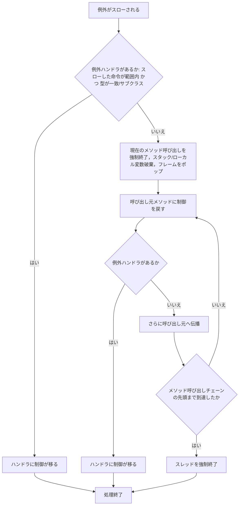
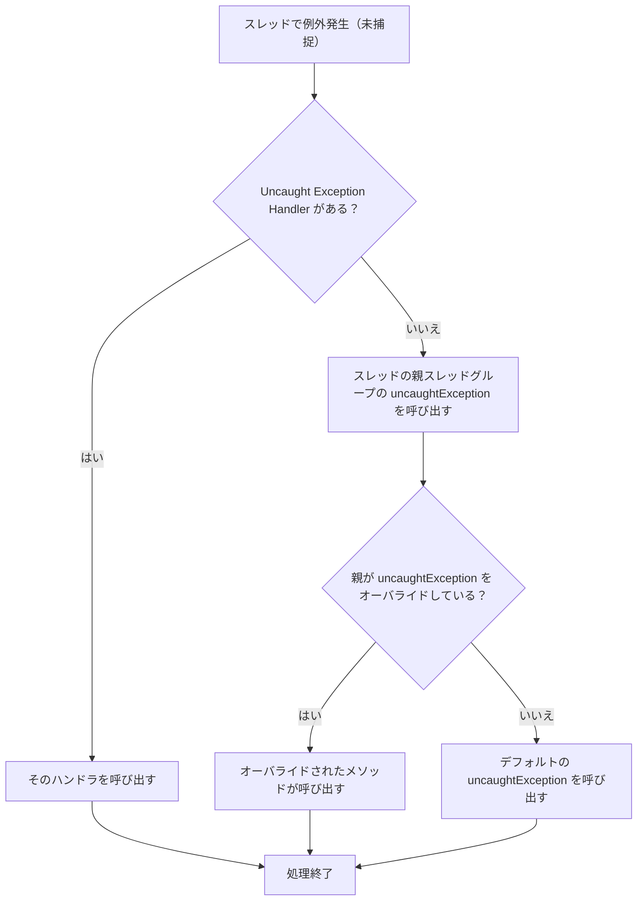

前回の続きです。前回はこちらから。

https://zenn.dev/peyang/articles/reading-jvm-chapter-02-7-8

このシリーズは，JVM の仕様書を読み解くためのガイドとして構成しています。
JVM の仕様書は非常に長大で難解な内容が多いため，各セクションごとに要点をまとめていきます。
また，JVM の内部構造や動作原理を知ることで，Java のパフォーマンスやセキュリティ，メモリ管理の仕組みを深く理解する試みです。

シリーズはこちらから。

https://zenn.dev/peyang/articles/reading-jvm-chapter-00

## 第二章 The Structure of the Java Virtual Machine

JVM の仕様書の第２章は「Java Virtual Machine の構造」です。
といいましてもこの章は全７章ある JVM の仕様書の中でも特に長く，また特に複雑な内容ですので，この記事では複数に分けて解説していきます。

ここでは Chapter 2.9, 2.10 の内容を扱います。

:::message alert
もう次回予告をしてしまいますが，次の記事では，Chapter 2.11 以降の内容を扱います。
この 2.11 というのは JVM 仕様書のなかでも（文章部分が）屈指の長さを誇るセクションです。ですから，この記事は嵐の前の静けさといったところでしょうか。
とりあえずこの記事は比較的軽い内容になる予定ですので，ご安心ください。
:::

## 2.9 特別なメソッド（[› 2.9 Special Methods](https://docs.oracle.com/javase/specs/jvms/se24/html/jvms-2.html#jvms-2.9)）

JVM は，特定の（名前と）シグニチャを持つメソッドを *Special Method* として特別扱いしています。
これらのメソッドは，特定の目的や動作を持ち，通常のメソッドとは異なる扱いを受けます。

特別なメソッドは，以下の３つに分類されます：
1. [インスタンス初期化メソッド](#291-インスタンス初期化メソッド-291-instance-initialization-methods)
2. [クラス初期化メソッド](#292-クラス初期化メソッド-292-class-initialization-methods)
3. [シグネチャ多態メソッド](#293-シグネチャ多態メソッド-293-signature-polymorphic-methods)

### 2.9.1 インスタンス初期化メソッド（[› 2.9.1 Instance Initialization Methods](https://docs.oracle.com/javase/specs/jvms/se24/html/jvms-2.html#jvms-2.9.1)）

クラスにはインスタンス初期化メソッドが通常存在し，これは Java のコンストラクタに対応します。
これは**存在しない場合**もありますし，或いは**複数存在する場合**もあります。

或るメソッドがインスタンス初期化メソッドとなる条件は，以下のとおりです：

1. （インタフェースではなく）クラスに属すること
2. 名前が `<init>` であること
3. シグニチャが `(...)V` であること（`void` 戻り値を持つこと）

:::message alert
クラスにおいて， `<init>` という名前で，かつ `void` 戻り値ではないメソッドは**インスタンス初期化メソッドではありません**。 インタフェースにおいても同様です。

これらのメソッドは，他の命令によって決して**呼び出せず**，また**存在もできません**。
（検証時にエラーが発生します。）

Java コードでは `<init>` という名前のメソッドを作成できないので，通常は意識することはありませんが…
:::

インスタンス初期化メソッドの宣言と呼び出しは， JVM によって監督されます。
例えば宣言時には，使用できるアクセス修飾子や記述するコードの内容に決まりがあります。

呼び出し時は，**初期化されていないインスタンスに対して**のみ `invokespecial` 命令を使用して呼び出せます。
（すでにそのインスタンスが初期化されている場合には，どのような呼び出しもできません。）


### 2.9.2 クラス初期化メソッド（[› 2.9.2 Class Initialization Methods](https://docs.oracle.com/javase/specs/jvms/se24/html/jvms-2.html#jvms-2.9.2)）

クラス（またはインタフェース）は，多くて１個のクラス（インタフェース）初期化メソッドを持ちます。

このメソッドは，通常 Java の `static` 初期化子に対応し，次の条件を満たす必要があります：

1. 名前が `<clinit>` であること
2. シグニチャが `(...)V` であること（`void` 戻り値を持つこと）
3. Java SE 7 以降（*major version * >= 51）では，`ACC_STATIC` フラグを持つこと
4. Java SE 9 以降（*major version * >= 53）では，**引数を取らないこと**（シグニチャが `()V` であること）
   
:::message
ちなみに， Java SE 6 までは， `<clinit>` という名前でかつ `ACC_STATIC` フラグを持つメソッドは，
一律でクラス初期化メソッドとして扱われていました。
:::

:::message alert
これも[インスタンス初期化メソッド](#291-インスタンス初期化メソッド-291-instance-initialization-methods)と同様に，クラスにおいて `<clinit>` という名前で，かつ **`void` 戻り値ではない**メソッドは**クラス初期化メソッドではありません**。

また，これも同じく Java コードでは `<clinit>` という名前のメソッドを作成できないので，通常は意識することはありません。
:::

### 2.9.3 シグネチャ多態メソッド（[› 2.9.3 Signature Polymorphic Methods](https://docs.oracle.com/javase/specs/jvms/se24/html/jvms-2.html#jvms-2.9.3)）

次の条件を満たすメソッドは，シグニチャ多様メソッド（*Signature Polymorphic Method*）と呼ばれます：

1. **`java/lang/MethodHandle` クラスまたは `java/lang/invoke/VarHandle` クラスに属すること**
2. `Object[]` 型の引数を１つ持つこと
3. `ACC_VARGS` および `ACC_NATIVE` フラグを持つこと

通常のメソッドは，戻り値の型や引数の型，名前でシグニチャガ固定されており，呼び出す際もそれが異なるとエラーになります。
しかしながらこれは唯一の例外で，JVM はこのメソッドを特別に扱い，実際の引数の型を考慮して適切に呼び出します。

`MethodHandle` クラスは，Java SE 7 以降に導入された `java.lang.invoke` パッケージの一部であり、動的なメソッド呼び出しを可能にします。
さらに同じパッケージに定義される `LambdaMetafactory` クラスは，ラムダ式の生成と呼び出しをサポートします。
これらのクラスは，Java の動的なメソッド呼び出しやラムダ式の実行を効率的に行うために設計されています。
その中でのメソッドの呼び出しは，実行時に引数の型に応じて柔軟に変化します。

例えば `MethodHandle->invoke` の呼び出しは
```java
someMethodHandle.invoke(1, "abc", true);
```
のように，実行時の型に応じて柔軟に変化する必要があります。
そのため，コンパイル時には

```java
class java/lang/invoke/MethodHandle {
    public final native Object invoke(Object...args);
}
```
という定義であっても，実際には `int`, `String`, `boolean` などの型を柔軟に受け取ります。
上記定義は普通の可変引数メソッドに見えますが，バイト・コード的にはシグニチャ多態メソッドとして扱われます。

:::message alert 
ちょこっと裏話

これらのメソッドを呼び出すときには，実行時に型安全性を保証できないために，呼び出し元で明示的なキャストが必要です。
或いは [`java/lang/invoke/MethodHandle->invoke`][invoke] と [`java/lang/invoke/MethodHandle->invokeExact`][invokeExact] のように，異なる *Signature Polymorphic Method* を使い分ける必要があります。

通常は Java コンパイラ（`javac`）が適切に選択してくれますが，手動でバイトコードを生成する場合には注意が必要です。
:::

[invoke]: https://docs.oracle.com/javase/jp/24/docs/api/java.base/java/lang/invoke/MethodHandle.html#invoke(java.lang.Object...)
[invokeExact]: https://docs.oracle.com/javase/jp/24/docs/api/java.base/java/lang/invoke/MethodHandle.html#invokeExact(java.lang.Object...)


### まとめ

JVM の特別なメソッドは，インスタンス初期化メソッド、クラス初期化メソッド、シグネチャ多態メソッドの３つに分類されます。
これらのメソッドは，特定の目的や動作を持ち，通常のメソッドとは異なる扱いを受けます。
特別なメソッドは，JVM の動作やクラスの初期化，動的なメソッド呼び出しを効率的に行うために設計されています。


## 2.10 例外（[› 2.10 Exceptions](https://docs.oracle.com/javase/specs/jvms/se24/html/jvms-2.html#jvms-2.10)）

JVM における例外は， `java/lang/Throwable` クラスを親に持つサブクラスによって表現されます。
例外をスローすると，直ちにそのメソッド内から制御が戻され，呼び出し元のメソッドに制御が移ります。

**ほとんどの例外**は，それが発生したスレッドの動作に起因して**同期的に発生**します。
一方で，**非同期的な例外**は，（強制割り込みのように）プログラムの実行中の任意のタイミングで発生する可能性があり，**スレッドの実行を中断することがあります**。

:::message
なお**非同期的な例外**がスローされる前には，ごく短時間のプログラムの続行が許容されることがあります。
この場合は，コードが例外を検出して，**キリの良いところまで処理を続行してから**改めてこの例外をスローするといったことができます。
:::

### 例外の発生条件

例外は，以下のいずれかの条件で発生します：

1. `athrow` 命令が実行されたとき
2. JVM 内部でエラーが発生したとき（非同期的な例外となる）
3. JVM によってプログラムの異常が検出されたとき

特に，「3 JVM によってプログラムの異常が検出されたとき」では，JVM はプログラムの異常を検出し，適切な例外をスローします。
これは**コードの実行中に任意のタイミングで発生するものではなく**，特に以下の場合に発生します：

1. **命令が不正な操作を実行しようとしたとき**
   例えば…
   - 配列の範囲外へのアクセス
   - `null` 参照へのアクセス
   - 不正なキャスト
   - その他 Java 言語のセマンティクスに違反する操作
2. **リソースの不足が発生したとき**
   例えば…
   - メモリ不足
   - スタックオーバーフロー
   - その他のリソース制約に違反する操作
  
### 例外実行の超正確性

例外のスローは正確でなければなりません。
JVM が例外をスローするときは，その**例外が発生するまでの命令による副作用**（メモリ書き込みなど）は，**全てきちんと終わっていなければなりません**。
さらに，**例外が発生したあとの命令は，決して実行されてはなりません**。

例えば，例外が発生するまでに実行されたメモリの書き込みやローカル変数の変更，或いはスタック操作は，たとえ例外がスローされたとしても，その時点での状態を正確に反映している必要があります。
これは例外が発生した時点でのプログラムの状態を正確に保持するためです。

さらに例外後の命令についても，例えば最適化によって先読み（投機的実行）を行っていたとしても，例外がスローされた時点での状態を正確に反映している必要があります。
（投機実行された状態をキャンセルして，例外がスローされた時点での状態に戻す必要があります。）

:::message alert
たとえ JIT(Just-In-Time) や AOT(Ahead-Of-Time) コンパイラで最適化を行いたくても，副作用の順序性は絶対に遵守されなければなりません。
:::

例えば，以下の Java コードを考えます：
```java
public class Example {
    public static void main(String[] args) {
        int[] arr = new int[5];
        arr[10] = 42; // ここで ArrayIndexOutOfBoundsException が発生する
        System.out.println("This line will not be executed.");
    }
}
```

このとき，例外のスローは `arr[10] = 42;` の命令が実行された後に行われます。
このため`arr` 配列の状態は例外がスローされるまでの状態を正確に反映する必要があります。

もしここで例外の発生を無視して `System.out.println("This line will not be executed.");` の命令が実行されてしまうと，プログラムの状態は不正確となり， その JVM の実装は正確性を欠くことになります。

### 例外の処理

#### 例外ハンドラについて

メソッドは，**例外ハンドラ**という特別なコードブロックを持ちます。
これは**無い場合**もありますし，**或いは複数個存在する場合**もあります。
例外ハンドラは Java で言うところの `try-catch` ブロックに相当し，例外が発生したときにその例外を処理するためのコードを含みます。

各例外ハンドラは，以下の情報を持ちます：

1. **例外の型**：このハンドラが処理する例外の型を指定します（e.g. `java/lang/NullPointerException`  など）。
2. **有効範囲**：このハンドラが適用される命令の範囲を命令オフセットで指定します。
3. **ハンドラのオフセット**：例外が発生したときにジャンプする（制御が移る）命令のオフセットを指定します。  
  これは `try-catch` ブロックの `catch` 部分の開始位置に相当します。

```java
try {
    // 命令 offset: start ～ end の範囲
    // ここに例外が発生しうる命令群があるとする。
}
catch (NullPointerException e) { // 例外の型
    // handlerOffset で指定された位置
    // 例外発生時にここにジャンプしてくる。
}
```

#### 例外のスローとハンドラの探索

例外が発生すると，JVM は以下の条件を満たす例外ハンドラを探して，そのハンドラに制御を移します：
1. 例外をスローした命令が，或る例外ハンドラの有効範囲内にあること
2. 例外の型が，そのハンドラが処理する例外のクラスと一致する，またはそのサブクラスであること

例外が発生した命令を持つメソッドに，適合する例外ハンドラが見つからない場合は，JVM は現在のメソッド呼び出しを強制終了します。
その場合は，現在のオペランドスタックとローカル変数は破棄され，フレームもポップされた後破棄されます。
その後呼び出し元メソッドのフレームが復元され，例外はその環境で**再度スローされます**。

呼び出し元メソッドに処理が移った後は，再度該当する例外ハンドラを探し，見つかった場合はそのハンドラに制御が移ります。
もし呼び出し元メソッドにも適合する例外ハンドラが見つからない場合は，メソッドの呼び出しチェーンを辿って，適合するハンドラが見つかるまで続けます。

もし適合するハンドラが，メソッド呼び出しチェーンを先頭まで辿っても見つからない場合には，JVM はそのスレッドを強制終了します。
スレッドが終了する前には，キャッチされていない例外は次のように処理されます：

1. スレッドに関連付けられた **キャッチされていない例外のハンドラ**（*Uncaught Exception Handler*）がある場合は，そのハンドラが呼び出されます。
2. 存在しない場合には，そのスレッドの親であるスレッド・グループの *uncaughtException()* メソッドが呼び出されます。
3. 親がそれをオーバ・ライドしていない場合には，デフォルトの *uncaughtException()* メソッドが呼び出されます。

:::message
例外ハンドラの探索順序は非常に重要です。
各例外ハンドラはクラス・ファイル内のテーブルに格納されています。
JVM は，例外ハンドラを探索する際に，このテーブルを順に走査していきます。
:::

:::message
JVM は，メソッドの例外テーブルのネストや，順序付けを矯正しません。
Java 言語では `try-catch` ブロックのネストをできますが，これはあくまでもコンパイラがうまく考慮をしているのみで，JVM の仕様としては，例外ハンドラのネストは存在しません。
クラス・ファイルが他の手段で生成される場合には，定義された探索順序に従って，全ての JVM 実装の動作が一貫していることが保証されます。
:::

### 例外のフロー図

例外発生から処理まで：



スレッドの強制終了処理：



### まとめ

いかがでしたか。
JVM における例外は `java/lang/Throwable` クラスを親に持つサブクラスによって表現されます。
例外は，`athrow` 命令が実行されたときや，JVM 内部でエラーが発生したときにスローされます。

例外のハンドラは，メソッド内に定義されて，例外が発生したときにその例外を処理するためのコードを含みます。
例外が発生すると，JVM は適切な例外ハンドラを探して制御を移します。
もし適合するハンドラが見つからない場合は，呼び出し元メソッドに制御が戻され，再度ハンドラを探します。

もし適合するハンドラが見つからない場合は，JVM はスレッドを強制終了し，キャッチされていない例外のハンドラを呼び出します。
このように，JVM は例外のスローと処理を厳密に管理し，プログラムの状態を正確に保つことを保証しています。

次回は Chapter 2.11 ～ Chapter 2.11.4 の内容を扱います。
このセクションは JVM 仕様書の中でも特に長く，また複雑な内容です。
具体的には，JVM の命令セットやスタックマップフレームの計算方法などが含まれます。

では，よいバイト・コードライフを！

#### 次回リンク

https://zenn.dev/peyang/articles/reading-jvm-chapter-02-11-1-4
