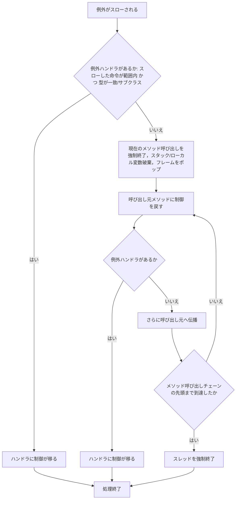
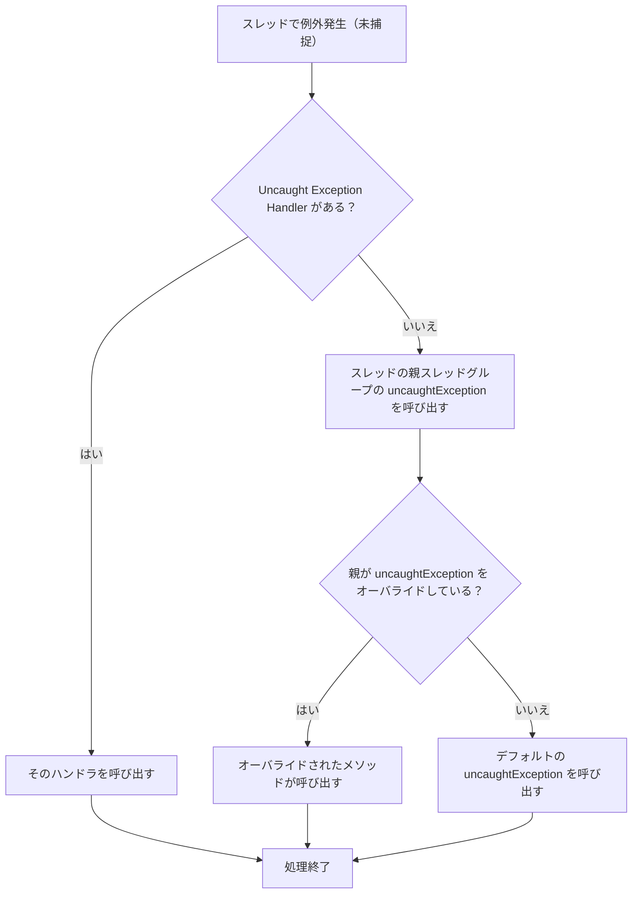

前回の続きです。前回はこちらから。

https://zenn.dev/peyang/articles/reading-jvm-chapter-02-7-8

このシリーズは，JVM の仕様書を読み解くためのガイドとして構成しています。
JVM の仕様書は非常に長大で難解な内容が多いため，各セクションごとに要点をまとめていきます。
また，JVM の内部構造や動作原理を知ることで，Java のパフォーマンスやセキュリティ，メモリ管理の仕組みを深く理解する試みです。

シリーズはこちらから。

https://zenn.dev/peyang/articles/reading-jvm-chapter-00

## 第二章 The Structure of the Java Virtual Machine

JVM の仕様書の第２章は「Java Virtual Machine の構造」です。
といいましてもこの章は全７章ある JVM の仕様書の中でも特に長く，また特に複雑な内容ですので，全８回に分けて解説していきます。

ここでは Chapter 2.9, 2.10 の内容を扱います。

:::message alert
もう次回予告をしてしまいますが，次の記事では，Chapter 2.11 以降の内容を扱います。
この 2.11 というのは JVM 仕様書のなかでも（文章部分が）屈指の長さを誇るセクションです。ですから，この記事は嵐の前の静けさといったところでしょうか。
とりあえずこの記事は比較的軽い内容になる予定ですので，ご安心ください。
:::

## 2.9 特別なメソッド（[› 2.9 Special Methods](https://docs.oracle.com/javase/specs/jvms/se24/html/jvms-2.html#jvms-2.9)）

JVM は，特定の名前とシグニチャ（引数と返り値）を持つメソッドを *Special Method* として特別扱いしています。
これらのメソッドは，特定の目的や動作を持ち，通常のメソッドとは異なる扱いを受けます。

特別なメソッドは，以下の３つに分類されます：
1. [インスタンス初期化メソッド](#2.9.1-インスタンス初期化メソッド（›-2.9.1-instance-initialization-methods）)
2. [クラス初期化メソッド](2.9.2-クラス初期化メソッド（›-2.9.2-class-initialization-methods）)
3. [シグネチャ多態メソッド](#2.9.3-シグネチャ多態メソッド（›-2.9.3-signature-polymorphic-methods）)

### 2.9.1 インスタンス初期化メソッド（[› 2.9.1 Instance Initialization Methods](https://docs.oracle.com/javase/specs/jvms/se24/html/jvms-2.html#jvms-2.9.1)）

各クラスには，「インスタンス初期化メソッド」（*Instance Initialization Method*）が（通常は）存在します。これは**存在しない場合**もありますし，或いは**複数存在する場合**もあります。
Java の**コンストラクタ**に対応するメソッドであり，インスタンスが生成されるときに呼び出されるものです。

或るメソッドがインスタンス初期化メソッドとなる条件は以下のとおりです：

1. （インタフェースではなく）クラスに属すること
2. 名前が `<init>` であること
3. シグニチャが `(...)V` であること（`void` 戻り値を持つこと）

:::message alert
クラスにおいて， `<init>` という名前で，かつ `void` 戻り値ではないメソッドは**インスタンス初期化メソッドではありません**。

これらのメソッドは，他の命令によって決して**呼び出せず**，また**存在もできません**。
（検証時にエラーが発生します。）

Java コードでは `<init>` という名前のメソッドを作成できないので，通常は意識しない部分ですね（これもまた，JVM 仕様の面白いところです）。
:::

#### インスタンス初期化メソッドの宣言と呼び出し

インスタンス初期化メソッドの宣言と呼び出しは， JVM によって監督されます。
例えば宣言時には，使用できるアクセス修飾子や記述するコードの内容に決まりがあります。

インスタンス初期化メソッドは，**初期化されていないインスタンスに対して**のみ `invokespecial` 命令を使用して呼び出せます。
（すでにそのインスタンスが初期化されている場合には，どのような呼び出しもできません。）

例えば，`HelloWorld` クラスのインスタンスを作成する場合には，次のようにします：

```java
HelloWorld obj = new HelloWorld();
```

これをコンパイルすると，概ね次のようなバイトコードになります：

```java
// HelloWorld クラスのインスタンスを作成する。初期化はまだされていない。
new HelloWorld
// インスタンスを複製する
dup
// インスタンス初期化メソッドを呼び出す。
invokespecial HelloWorld-><init>()V
// 初期化したインスタンスをローカル変数に保存する
astore_1
```

このように，`new` 命令でインスタンスを作成した直後に，`invokespecial` 命令でインスタンス初期化メソッドを呼び出します。

`dup` 命令を用いて，スタックに**複製したインスタンスを保持しておくことがポイント**です。
これは，`invokespecial` 命令がインスタンスを引数（オペランド）として受け取る際に，スタックからインスタンスを取り出して消費してしまうためです。
そのため，予め２つのインスタンスをスタックに積んでおくことで，片方を `invokespecial` 命令に渡し，もう片方を `astore` 命令のために保持しておくのです。

### 2.9.2 クラス初期化メソッド（[› 2.9.2 Class Initialization Methods](https://docs.oracle.com/javase/specs/jvms/se24/html/jvms-2.html#jvms-2.9.2)）

各クラス（またはインタフェース）は，**クラス初期化メソッド**（*Class Initialization Method*）を１つだけ持つことができます（**存在しない場合**もあります）。
このメソッドは，通常 Java の `static` ブロックに対応します。

クラス初期化メソッドは，クラスが初めて使用されるときに**JVM によって自動的に呼び出されます**。 そのため，命令などによって**プログラムが呼び出すことは絶対にできません**。

或るメソッドがクラス初期化メソッドとなる条件は以下のとおりです：

1. 名前が `<clinit>` であること
2. シグニチャが `(...)V` であること（`void` 戻り値を持つこと）
3. Java SE 7 以降（*major version * >= 51）から：`ACC_STATIC` フラグを持つこと
4. Java SE 9 以降（*major version * >= 53）から：**引数を取らないこと**（シグニチャが `()V` であること）
   
:::message
ちなみに， Java SE 6 までは `<clinit>` という名前でかつ `ACC_STATIC` フラグを持つメソッドは， 一律でクラス初期化メソッドとして扱われていました。
:::

:::message alert
これも[インスタンス初期化メソッド](#291-インスタンス初期化メソッド-291-instance-initialization-methods)と同様に，`<clinit>` という名前であっても，条件を満たさないメソッドは**クラス初期化メソッドではありません**。

また，これも同じく Java コードでは `<clinit>` という名前のメソッドを作成できないので，通常は意識することはありません。
:::

### 2.9.3 シグネチャ多態メソッド（[› 2.9.3 Signature Polymorphic Methods](https://docs.oracle.com/javase/specs/jvms/se24/html/jvms-2.html#jvms-2.9.3)）

JVM は上記のメソッドの他に，**シグネチャ多態メソッド**（*Signature Polymorphic Method*）という特別なメソッドを定義しています。
ここまでは JVM の根本的な仕様でしたが，このセクションでは Java SE 7 以降に導入された新しい概念を扱っています。

シグニチャ多態メソッドは，Java の標準ライブラリにおいて，**ラムダ式の実装や動的なメソッド呼び出しをサポート**するために使用されます。
そのため，軽い JVM の実装では，これらのメソッドをサポートしない場合もあります。

或るメソッドがシグネチャ多態メソッドとなる条件は以下のとおりです：

1. **`java/lang/invoke/MethodHandle` クラスまたは `java/lang/invoke/VarHandle` クラスに属すること**
2. `Object[]` 型の引数を１つ持つこと
3. `ACC_VARGS` および `ACC_NATIVE` フラグを持つこと

通常のメソッドは，名前とシグニチャ（引数の型と戻り値の型）によって一意に識別されます。
しかしシグニチャ多態メソッドは唯一の例外で，**実際の引数の型に応じて動的に振る舞いが変化**します。

#### シグニチャ多態メソッドの呼び出し

例えば，次の通常メソッドを呼び出す場合を考えます：

```java
void someMethod(int a, String b, Object[]);
```
このメソッドを呼び出すときには，コンパイル時に引数の型が決定され，次のように呼び出します：

```java
invokevirtual SomeClass->someMethod(ILjava/lang/String;[Ljava/lang/Object;)V
```

この`(...)...`という文字列は，「シグニチャ」というメソッドを識別するための重要な情報です。 JVM は名前とシグニチャの組み合わせでメソッドを識別します。
一方で，シグニチャ多態メソッドは，実際の引数の型に応じて動的に振る舞いが変化します。

```java
// （MethodHandle クラスに定義されているものとして）
native Object someSigPoly(Object... args);
```

このメソッドは，あらゆる引数を受け取ります（Object の可変長引数としてではなく，ネイティブ・レベルで）。
どういうことかといいますと，例えば，次のように呼び出せます。

```java
invokevirtual java/lang/invoke/MethodHandle->someSigPoly(IB)Z
```

この例のように，実際の宣言は`([Ljava/lang/Object;)Ljava/lang/Object;`であるにもかかわらず，`(IB)Z`のように，実際の引数の型に応じたシグニチャで呼び出せるのです。
（前者は，`Object[]` 型の引数を１つ持ち，`Object` 型の戻り値を持つメソッドであることを示し，後者は，`int` 型と `byte` 型の引数を持ち，`boolean` 型の戻り値を持つメソッドであることを示します。）

このように，シグニチャ多態メソッドはメソッドのシグニチャを動的に変化させ，あらゆる型の引数を `Object` としてではなく，そのままの型で受け取ります。 

#### これが必要な理由

`MethodHandle` クラスは，Java SE 7 以降に導入された `java.lang.invoke` パッケージの一部であり，動的なメソッド呼び出しを可能にします。 さらに同じパッケージに定義される `LambdaMetafactory` クラスは，ラムダ式の生成と呼び出しをサポートします。
これらのクラスは，Java の動的なメソッド呼び出しやラムダ式の実行を効率的に行うために設計されています。 その中でのメソッドの呼び出しは，実行時に引数の型に応じて柔軟に変化する必要があるのです。

:::message alert 
ちょこっと裏話

これらのメソッドを呼び出すときには，実行時に型安全性を保証できないために，呼び出し元で明示的なキャストが必要です。
或いは [`java/lang/invoke/MethodHandle->invoke`][invoke] と [`java/lang/invoke/MethodHandle->invokeExact`][invokeExact] のように，異なる *Signature Polymorphic Method* を使い分ける必要があります。

通常は Java コンパイラ（`javac`）が適切に選択してくれますが，手動でバイトコードを生成する場合には注意が必要です。
:::

[invoke]: https://docs.oracle.com/javase/jp/24/docs/api/java.base/java/lang/invoke/MethodHandle.html#invoke(java.lang.Object...)
[invokeExact]: https://docs.oracle.com/javase/jp/24/docs/api/java.base/java/lang/invoke/MethodHandle.html#invokeExact(java.lang.Object...)

### 補足：メソッド・ディスクリプタについて

`()V` や `([Ljava/lang/String;)V` は，メソッド・ディスクリプタ(*method descriptor*)と呼ばれるものです。
これは名前と合わせてメソッドを一意に識別するためのもので，JVM ではこのようにしてメソッドを識別します。

メソッド・ディスクリプタは，タイプ・ディスクリプタ(*type descriptor*)を使用してメソッドの引数と戻り値の型を表現します。
タイプ・ディスクリプタは次のような形式で表現されます。
- `B` - `byte` 型を表します。
- `C` - `char` 型を表します。
- `D` - `double` 型を表します。
- `F` - `float` 型を表します。
- `I` - `int` 型を表します。
- `J` - `long` 型を表します。
- `S` - `short` 型を表します。
- `Z` - `boolean` 型を表します。
- `V` - 戻り値がないことを表します。
- `L` - `L<クラス名>;` の形式でクラス型を表します。
- `[` - 配列型を表します。例えば `[[I` は `int` 型の二次元配列を表します。

メソッド・ディスクリプタは，このタイプ・ディスクリプタを組み合わせて表現されます。
構文は次のようになります。
```
(<引数の型>[引数2の型...])<戻り値の型>
```
例：
- `([Ljava/lang/String;)V` は，引数として `java/lang/String` 型の配列を受け取り，戻り値がないことを示しています。
- `(I)Ljava/lang/String;` は，引数として `int` 型を受け取り，戻り値として `java/lang/String` 型を返すことを示しています。
- `(I)[Ljava/lang/String;` は，引数として `int` 型を受け取り，戻り値として `java/lang/String` 型の配列を返すことを示しています。
- `(Ljava/lang/String;I)Z` は，引数として `java/lang/String` 型と `int` 型を受け取り，戻り値として `boolean` 型を返すことを示しています。


### まとめ

JVM の特別なメソッドは，インスタンス初期化メソッド，クラス初期化メソッド，シグネチャ多態メソッドの３つに分類されます。
これらのメソッドは，特定の目的や動作を持ち，通常のメソッドとは異なる扱いを受けます。
特別なメソッドは，JVM の動作やクラスの初期化，動的なメソッド呼び出しを効率的に行うために設計されています。


## 2.10 例外（[› 2.10 Exceptions](https://docs.oracle.com/javase/specs/jvms/se24/html/jvms-2.html#jvms-2.10)）

例外とは，プログラムの実行中に自身の意図しない異常な状態が発生したことを示す仕組みです。
例外を発生（スロー）することで，プログラムの通常の制御フローを中断し，例外を処理するための特別なコード（例外ハンドラ）に制御を移します。

### JVM における例外

JVM が取り扱う全ての例外は **`java/lang/Throwable` クラスを親に持つサブクラス**によって表現されます。
例えば `java/lang/Exception` クラスや `java/lang/Error` クラスは，`Throwable` クラスの直接のサブクラスです。さらに `Exception` クラスのサブクラスとして，`java/lang/RuntimeException` クラスや `java/io/IOException` クラスなどがあります。

或るメソッド内で例外がスローされると，直ちにそのメソッドの呼び出し元に制御が戻されます。このとき，**例外をスローしたメソッドのフレームは破棄されます**。
このことについては，例外の伝搬（propagation）として後述します。

ほとんどの例外は，それが発生したスレッドの操作に起因して**同期的に発生**します。
一方で，**非同期的な例外**は（強制割り込みのように）プログラムの実行中の任意のタイミングで発生する可能性があり，**スレッドの実行を中断することがあります**。

:::message
なお**非同期的な例外**がスローされる前には，ごく短時間のプログラムの続行が許容されることがあります。
この場合は，コードが例外を検出して，**キリの良いところまで処理を続行してから**改めてこの例外をスローするといったことができます。
:::

### 例外の発生条件

例外は，以下のいずれかの事象の発生とともにスローされます：

1. `athrow` 命令をプログラムが実行されたとき
2. JVM 内部でエラーが発生したとき（非同期的な例外となる）
3. JVM によってプログラムの異常が検出されたとき

特に，「3 JVM によってプログラムの異常が検出されたとき」では，JVM はプログラムの異常を検出して適切な例外をスローします。
これは**コードの実行中に任意のタイミングで発生するものではなく**，特に以下の場合にJVMが例外をスローします：

1. **命令が不正な操作を実行しようとしたとき**
   例えば…
   - 配列の範囲外へのアクセス
   - `null` 参照へのアクセス
   - 不正なキャスト
   - その他 Java 言語のセマンティクスに違反する操作
2. **リソースの不足が発生したとき**
   例えば…
   - メモリ不足
   - スタックオーバーフロー
   - その他のリソース制約に違反する操作
  
### プログラム実行の超正確性

例外のスローは必ず，**プログラムの実行の超正確性**（*super-precise execution*）を保証します。
JVM が例外をスローするときには，その例外が発生するまでの命令による作用（メモリ書き込みなど）は，全て完了している必要があります。 さらに，**例外が発生したあとの命令は，決して実行されてはなりません**。

さらに例外後の命令についても，例えば最適化によって先読み（投機的実行）を行っていたとしても，例外がスローされた時点での状態を正確に反映している必要があります。
（投機実行された状態をキャンセルして，例外がスローされた時点での状態に戻す必要があります。）

例えば，以下の Java コードを考えます：
```java
public class Example {
    public static void main(String[] args) {
        int[] arr = new int[5];
        arr[10] = 42; // ここで ArrayIndexOutOfBoundsException が発生する
        System.out.println("This line will not be executed.");
    }
}
```

このとき，`arr[10] = 42;` の命令が実行されると，（その実行中に）`ArrayIndexOutOfBoundsException` がスローされます。しかしながら，`arr` という配列が初期化されたという状態は，例外のスロー前に確定しているはずです。
したがって，JVM は `arr` 配列の初期化を**例外のスロー前に確定させる必要があります**。

さらに，`System.out.println("This line will not be executed.");` の命令は，例外がスローされた後に実行されることは決してありません。これを実行してしまうと，プログラムの状態は不正確となり，信頼できない JVM が出来上がってしまいます。

:::message alert
たとえ JIT(Just-In-Time) や AOT(Ahead-Of-Time) コンパイラでプログラムを最適化していても，**副作用の順序性は絶対に遵守されなければなりません**。
:::

### 例外の処理

JVM 内で発生した例外は，同じメソッドの例外ハンドラ（*exception handler*）に制御が移されます。
例外ハンドラは，`try-catch` ブロックに対応するもので，例外が発生したときに制御を移すためのコードの範囲を指定します。

もし，例外をスローしたメソッドに適合する例外ハンドラが見つからない場合は，JVM は現在のメソッド呼び出しを強制終了し，呼び出し元メソッドに制御を移し，例外を再度スローします。
このようにして，例外ハンドラが見つかるまで，メソッド呼び出しチェーンを辿っていきます。

#### 例外ハンドラについて

各メソッドは，コードの特定の範囲に対して，例外ハンドラ（*exception handler*）を定義できます。 これは，Java の `try-catch` ブロックに対応するもので，例外が発生したときに制御を移すためのコードの範囲を指定します。複数ある場合もありますし，１つも無い場合もあります。

各例外ハンドラは，以下の情報を持ちます：

1. **例外の型**：このハンドラが処理する例外の型を指定します（e.g. `java/lang/NullPointerException`  など）。
2. **有効範囲**：このハンドラが適用される命令の範囲を命令オフセットで指定します。
3. **ハンドラのオフセット**：例外が発生したときにジャンプする（制御が移る）命令のオフセットを指定します。  
  これは `try-catch` ブロックの `catch` 部分の開始位置に相当します。

`javap` で確認すると，例外ハンドラは以下のように表示されます：

```java
public static void main(java.lang.String[]);
  Code:
     0: iconst_1
     1: iconst_0
     2: idiv
     3: istore_1
     4: goto          16
     7: astore_1
     8: getstatic     #2                  // Field java/lang/System.out:Ljava/io/PrintStream;
    11: ldc           #3                  // String divided by zero
    13: invokevirtual #4                  // Method java/io/PrintStream.println:(Ljava/lang/String;)V
    16: return
  Exception table:
     from    to  target type
         0     4     7   Class java/lang/ArithmeticException
```

上記の例では，`0` から `4` の命令範囲で `java/lang/ArithmeticException` がスローされた場合に，`7` の命令に制御が移ることを示しています。
特に，この命令列では `idiv` 命令で `ArithmeticException` がスローされます（直前の `iconst_0` 命令で `0` をスタックに積むことで，0除算をする指示をしているため）。


#### 例外のスローとハンドラの探索

メソッドの実行中に例外が発生すると，JVM は以下の条件を満たす例外ハンドラを同じメソッド内で探します：
1. 例外がスローされた命令のオフセットが，ハンドラの有効範囲内にあること
2. スローされた例外の型が，ハンドラで指定された型と一致するか，そのサブクラスであること

適合する例外ハンドラがメソッド内に見つからない場合は，JVM は**現在のメソッド呼び出しを強制的に終了**します。その場合には，現在のオペランド・スタックとローカル変数は破棄されて，フレームはポップされた後に破棄されます。
そして，呼び出し元メソッドのフレームが復元され，例外が再度スローされます（なお，この場合には，例外を発生させたメソッドを呼び出している命令において再度スローされます）。

呼び出し元メソッドに制御が戻された後には，再度，そのメソッド内で適合する例外ハンドラを探します。適合する例外ハンドラがここでも見つからない場合には，メソッドの呼び出しチェーンを辿って，適合するハンドラが見つかるまでこの処理を繰り返します。

メソッド呼び出しチェーンを先頭まで辿っても見つからない場合には，JVM はそのスレッドを強制終了します。
スレッドが終了する前には，キャッチされていない例外は次のように処理されます：

1. スレッドに関連付けられた *Uncaught Exception Handler* がある場合は，そのハンドラが呼び出されます。
2. 存在しない場合には，そのスレッドの親であるスレッド・グループの *uncaughtException()* メソッドが呼び出されます。
3. 親がそれをオーバ・ライドしていない場合には，デフォルトの *uncaughtException()* メソッドが呼び出されます。

:::message
例外ハンドラの探索順序は非常に重要です。
複数の例外ハンドラが同じ命令範囲をカバーしている場合には，JVM はバイト・コード内で**最初に定義されているハンドラを優先**します。
:::

:::message
JVM は，メソッドの例外テーブルのネストや，順序付けを強制しません。
Java 言語では `try-catch` ブロックのネストをできますが，これはあくまでも，コンパイラがうまく考慮してしているだけで，JVM の仕様としては**ネストした例外ハンドラは存在しません**。
バイト・コードが Java 標準コンパイラ以外によって生成される場合には，定義された探索順序に従って，全ての JVM 実装の動作が一貫していることが保証されなければなりません。
:::

### 例外のフロー図

例外発生から処理まで：



スレッドの強制終了処理：



### まとめ

いかがでしたか。
JVM における例外は `java/lang/Throwable` クラスを親に持つサブクラスによって表現されます。
例外は，`athrow` 命令が実行されたときや，JVM 内部でエラーが発生したときにスローされます。

例外のハンドラは，メソッド内に定義されて，例外が発生したときにその例外を処理するためのコードを含みます。
例外が発生すると，JVM は適切な例外ハンドラを探して制御を移します。
もし適合するハンドラが見つからない場合は，呼び出し元メソッドに制御が戻され，再度ハンドラを探します。

もし適合するハンドラが見つからない場合は，JVM はスレッドを強制終了し，キャッチされていない例外のハンドラを呼び出します。
このように，JVM は例外のスローと処理を厳密に管理し，プログラムの状態を正確に保つことを保証しています。

次回は Chapter 2.11 ～ Chapter 2.11.4 の内容を扱います。
このセクションは JVM 仕様書の中でも特に長く，また複雑な内容です。
具体的には，JVM の命令セットやスタックマップフレームの計算方法などが含まれます。

では，よいバイト・コードライフを！

#### 次回リンク

https://zenn.dev/peyang/articles/reading-jvm-chapter-02-11-1-4

#### 参考文献＆リンク集

+ Lindholm, T., Yellin, F., Bracha, G., & Smith, W. M. D. (2025). [*The Java® Virtual Machine Specification: Java SE 24 Edition*](https://docs.oracle.com/javase/specs/jvms/se24/html/).
+ Lindholm, T., & Yellin, F. (1999). *The Java™ Virtual Machine Specification* (2nd ed.). Addison-Wesley. ISBN 978-0-201-43294-7
+ Otavio, S. (2024). *Mastering the Java Virtual Machine*.  Packet Publishing. ISBN 978-1-835-46796-1
