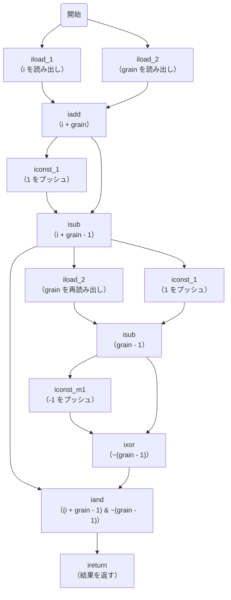
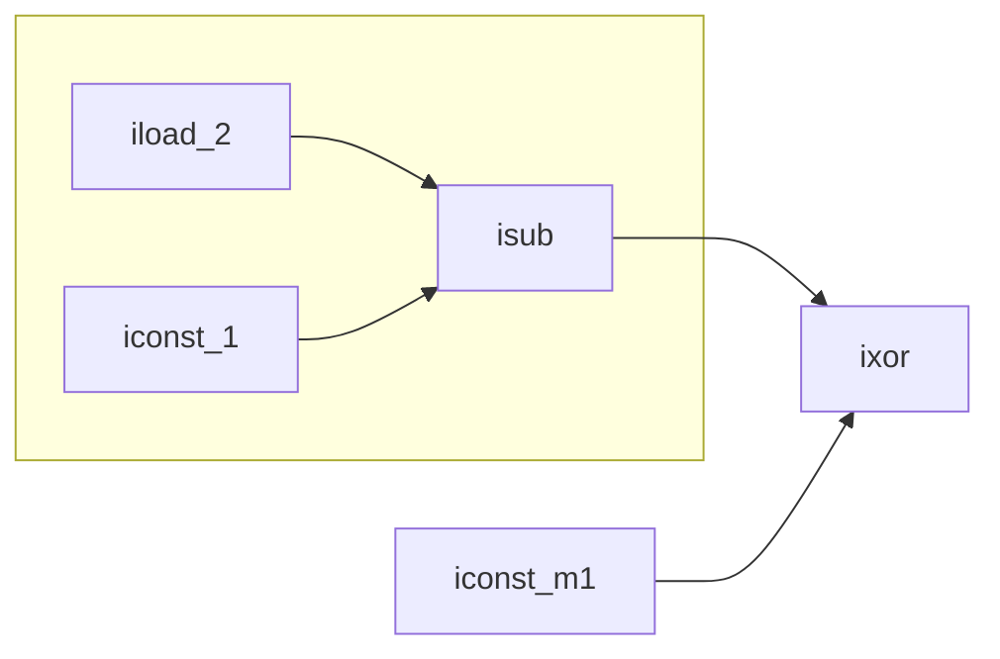

前回の続きです。前回はこちらから。

https://zenn.dev/peyang/articles/reading-jvm-chapter-03-2

このシリーズは，JVM の仕様書を読み解くためのガイドとして構成しています。
JVM の仕様書は非常に長大で難解な内容が多いため，各セクションごとに要点をまとめていきます。
また，JVM の内部構造や動作原理を知ることで，Java のパフォーマンスやセキュリティ，メモリ管理の仕組みを深く理解する試みです。

シリーズはこちらから。

https://zenn.dev/peyang/articles/reading-jvm-chapter-00

## 第三章 Compiling for the Java Virtual Machine

JVM の仕様書の第３章は「Java Virtual Machine のためのコンパイル」です。
この章では，Java ソースコードを JVM が実行可能なバイトコードに変換するためのコンパイル方法について説明しています。

今回からは，実際に JVM の命令と，その動作を理解するための具体的な例を見ていきましょう。

この記事では，定数やローカル変数の扱い，さらには制御変数としての使い方について学びます。

ハンド・ブックはこちらから。

https://zenn.dev/peyang/articles/reading-jvm-chapter-03-1

## 3.2 算術演算（[› 3.2 Arithmetic](https://docs.oracle.com/javase/specs/jvms/se24/html/jvms-3.html#jvms-3.2)）

JVM は通常，オペランド・スタックを使用して算術演算を行います（唯一の例外は，ローカル変数の値を直接操作する `iinc` 命令だけです）。

以下の `align2grain` メソッドは， `int` 型の引数 `x` と `y` を受け取り， `x` を `y` で指定された２のべき乗に切り上げた値を返すものです。

```java
int align2grain(int i, int grain) {
    return ((i + grain - 1) & ~(grain - 1));
}
```

これを JVM バイトコードに変換すると，以下のようになります。

```java
int align2grain(int i, int grain) {
    // i + grain - 1
    iload_1             // 引数 i     の値をスタックに積む
    iload_2             // 引数 grain の値をスタックに積む
    iadd                // これらを足し算してスタックに積む
    iconst_1            // 定数 1 をスタックに積む
    isub                // これらを引き算した結果をスタックに積む
    // grain - 1
    iload_2             // 引数 grain の値をスタックに積む
    iconst_1            // 定数 1 をスタックに積む
    isub                // これらを引き算した結果をスタックに積む
    // ~(grain - 1)
    iconst_m1           // 定数 -1 をスタックに積む
    ixor                // これらの排他的論理和（XOR）を取って結果をスタックに積む
    iand                // これらの論理積（AND）を取って結果をスタックに積む
    ireturn             // スタックの一番上の値を返す
}
```

:::details javap スタイルの命令例
```java
Method align2grain(int, int)
0   iload_1             // 引数 i     の値をスタックに積む
1   iload_2             // 引数 grain の値をスタックに積む
2   iadd                // これらを足し算してスタックに積む
3   iconst_1            // 定数 1 をスタックに積む
4   isub                // これらを引き算した結果をスタックに積む
5   iload_2             // 引数 grain の値をスタックに積む
6   iconst_1            // 定数 1 をスタックに積む
7   isub                // これらを引き算した結果をスタックに積む
8   iconst_m1           // 定数 -1 をスタックに積む
9   ixor                // これらの排他的論理和（XOR）を取って結果をスタックに積む
10  iand                // これらの論理積（AND）を取って結果をスタックに積む
11  ireturn             // スタックの一番上の値を返す
```
:::

以下の図は，この一連の命令の流れを示しています。



算術演算をする命令のオペランド（命令の引数）はオペランド・スタックから取り出されて，さらにその演算結果はオペランド・スタックに積まれます。
このことから，或る演算命令の演算結果を，**別の算術命令のオペランドとして**（ローカル変数にいれたりせずにとも）使用できることが分かります。

つまり，複数の算術演算を連続して行う場合は，**ただ連ねるだけで（副次的に入れ子構造のようになって）その結果を得られるのです**。
例えば `~(grain - 1)` の部分は，以下の命令で計算できます：

```java
// grain - 1 を計算する
0: iload_2         // grain をスタックに積む
1: iconst_1        // 1 をスタックに積む
2: isub            // これらを引き算した結果（grain - 1）をスタックに積む

// ~(grain - 1) を計算する
3: iconst_m1       // -1 をスタックに積む
4: ixor            // これらを排他的論理和（XOR）した結果（~(grain - 1)）をスタックに積む
```

以下の図は，この一連の命令の流れを示しています。



最初の `grain - 1` は，ローカル変数２の内容と，`iconst_1` 命令で生成した定数 `1` を引き算して得られます。
これらのオペランドはオペランド・スタックに積まれ，`isub` 命令で引き算されます。
そしてその結果は再度オペランド・スタックに積まれます。

ここで得られた `grain - 1` の値は，次の `iconst_m1` 命令で生成した定数 `-1` と排他的論理和（XOR）をとるためにすぐに使用されます。
（`~x == -1 ^ x` という性質を利用しています。）

同様に，この XOR の結果は後続の `iand` 命令のオペランドとなります。

#### この考え方の利用

この考え方は，JVM 命令の随所で利用されており，例えばメソッド呼び出しやフィールドアクセスなどでも同様に利用できます。

例えば以下の `getObjectVoice` メソッドは，`Object` クラスの `toString` メソッドを呼び出してその結果を返します。
```java
String getObjectVoice() {
    Object obj = new Object();
    return obj.toString();
}
```

これを JVM バイトコードに変換すると，以下のようになります。

```java
String getObjectVoice() {
    new java/lang/Object
    dup
    invokespecial java/lang/Object-><init>()V
    invokevirtual java/lang/Object->toString()Ljava/lang/String;
    areturn
}
```

この例では，`new` 命令で `Object` クラスのインスタンスを生成し，その参照をオペランド・スタックに積みます。
次に `dup` 命令でその参照を複製し，オペランド・スタックに再度積みます。
複製した参照は `invokespecial` 命令でコンストラクタを呼び出すために使用されます。
そして元の参照は `invokevirtual` 命令で `toString` メソッドを呼び出すために使用されます。

このように，JVM の命令はオペランド・スタックを利用して，算術演算やメソッド呼び出しを効率的に行います。

### 3.5 実行時定数プールにアクセスする（[› 3.5 Accessing the Run-Time Constant Pool](https://docs.oracle.com/javase/specs/jvms/se24/html/jvms-3.html#jvms-3.5)）

多くの数値定数，オブジェクトや，フィールド，さらにはメソッドは，現在のクラスの実行時定数プールに格納されており，ここにアクセスして使用します。

`int` 型や，`long` 型，`float` 型，`double` 型の値，および文字列への参照は，`ldc` 系の命令（`ldc` や, `ldc_w`, `ldc2_w`）を使って取得できます。
（オブジェクトへの参照は後述します。）

`ldc` 命令と `ldc_w` 命令は，カテゴリ１の定数（`double` 型または `float` 型以外の定数）を取得するために使用されます（文字列の取得にも使用されます）。
通常は `ldc` 命令を使用しますが，定数プールの項目が非常に多く，インデックスが 255 を超える場合には `ldc_w` 命令を使用します。

一方で `ldc2_w` 命令は，カテゴリ２の定数（`double` 型または `long` 型の定数）を取得するために使用されます。

:::message
なお，小さな整数の値（`byte` 型や `short`型, `char` 型および `boolean` 型の値を含む）は，`bipush` 命令や `sipush` 命令，或いは `iconst_<i>` 命令を替わりに使用できます。
それぞれ次の範囲を扱えます：
+ `bipush` 命令：*-128 ～ 127*（`byte` 型の範囲）
+ `sipush` 命令：*-32,768 ～ 32,767* （`short` 型の範囲）
+ `iconst_<i>` 命令：*0 ～ 5*（`int` 型の範囲）
  -> `iconst_0`, `iconst_1`, `iconst_2`, `iconst_3`, `iconst_4`, `iconst_5`

さらに浮動小数点数の値として，*0.0* や *1.0* などの小さな値は，`fconst_<f>`（`float`）, `dconst_<d>`（`double`）命令を使用して取得できます。
:::

以下のように，いずれの場合もコンパイルは簡単です。
```java
void useManyNumeric() {
    int i = 100;
    int j = 1000000;
    long l1 = 1;
    long l2 = 0xffffffff;
    double d = 2.2;
    
    // これらの値を使用する部分は省略します。
}
```

このコードを JVM バイトコードに変換すると，以下のようになります。
なお，以下のコードは説明するコードの性質から JAL 言語ではなく，単純に `javap` コマンドで得られる出力の結果を載せています。

```java
Method void useManyNumeric()
0   bipush 100      // byte 型の範囲に収まる値を扱う場合は bipush 命令を使う
2   istore_1
3   ldc #1          // 巨大な整数値（1,000,000）を扱う場合は ldc 命令を使う
5   istore_2
6   lconst_1        // 小さい long 値（0, 1）を扱う場合は lconst_<i> 命令を使う
7   lstore_3
8   ldc2_w #6       // 大きい long 値（0xffff_ffff）を扱う場合は ldc2_w 命令を使う
                    // なお，どのような long の値もldc2_w 命令で扱えます
11  lstore 5
13  ldc2_w #8       // double の定数（2.200000）を扱う場合は ldc2_w 命令を使う
                    // なお，どのような double の値も ldc2_w 命令で扱えます
16  dstore 7

// これらの値を使用する部分は省略します。
```

:::message
なお，これを `JAL` 言語で書くと以下のようになります。

```JAVA
void useManyNumeric() {
    bipush 100
    istore_1
    ldc 1000000
    istore_2
    lconst_1
    lstore_3
    ldc2_w 0xffffffff
    lstore_4
    ldc2_w 2.2
    dstore_5
}
```

JAL 言語では，定数プールの存在を意識する必要はありません。
そのため，`ldc` 命令や `ldc_w` 命令のオペランドには定数プールのインデックスではなく，プッシュしたい定数を直接指定します。
:::

### まとめ

いかがでしたか？
今回の記事では，JVM の算術演算と定数プールへのアクセス方法について学びました。
さらにオペランド・スタックを利用したあらゆる操作を効率化する方法についても紹介しました。

次回は，制御変数の様々な扱い方について学びます。
では，よいバイト・コードライフを！

### 次回リンク

https://zenn.dev/peyang/articles/reading-jvm-chapter-03-4

#### 参考文献＆リンク集

+ Lindholm, T., Yellin, F., Bracha, G., & Smith, W. M. D. (2025). [*The Java® Virtual Machine Specification: Java SE 24 Edition*](https://docs.oracle.com/javase/specs/jvms/se24/html/).
+ Lindholm, T., & Yellin, F. (1999). *The Java™ Virtual Machine Specification* (2nd ed.). Addison-Wesley. ISBN 978-0-201-43294-7
+ Otavio, S. (2024). *Mastering the Java Virtual Machine*.  Packet Publishing. ISBN 978-1-835-46796-1
+ Godfrey, N., & Koichi , M. (2010). *デコンパイリング Java ― 逆解析技術とコードの難読化*  ISBN 978-4-87311-449-1
