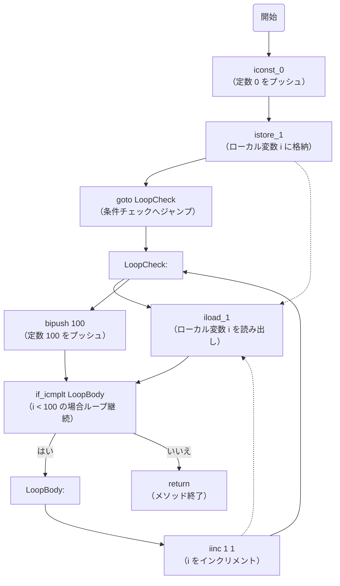
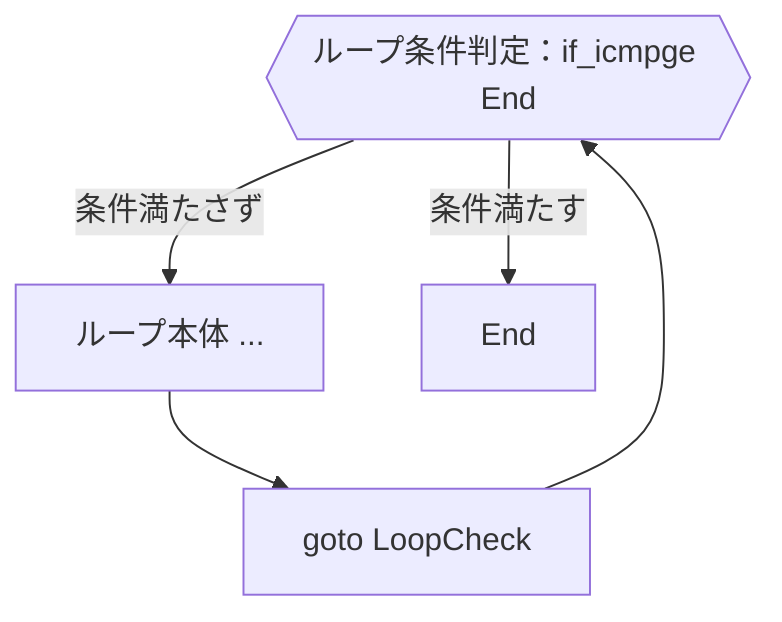
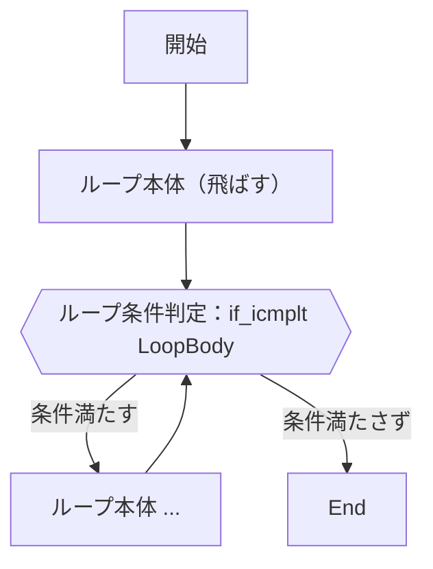
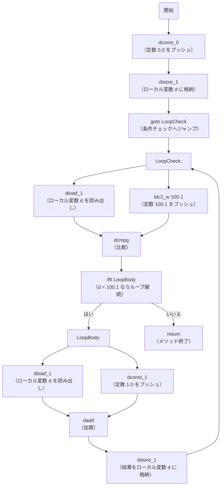
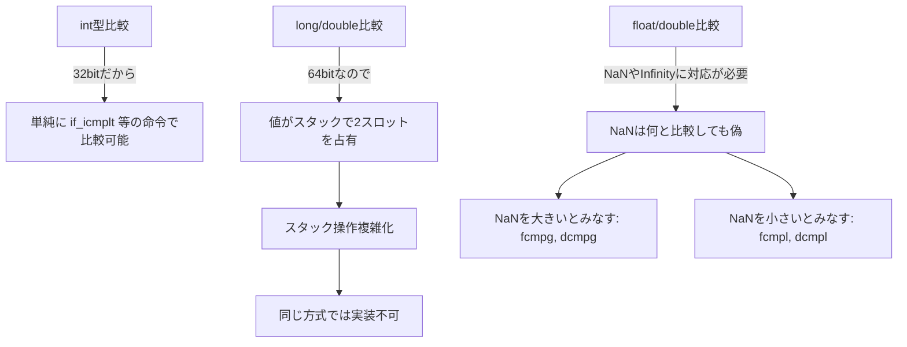
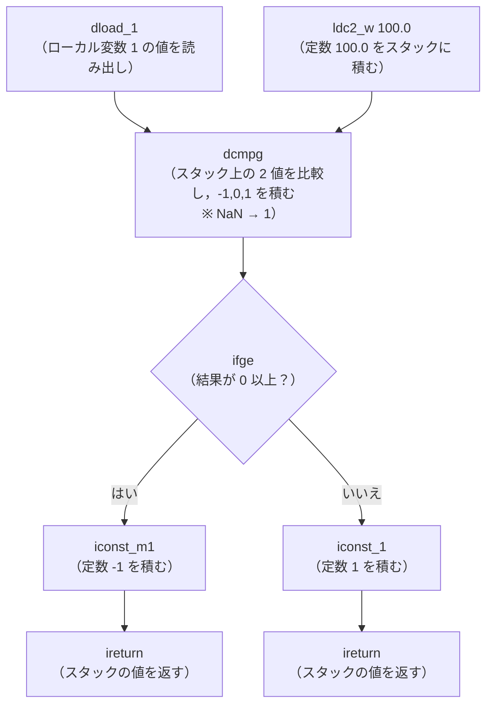
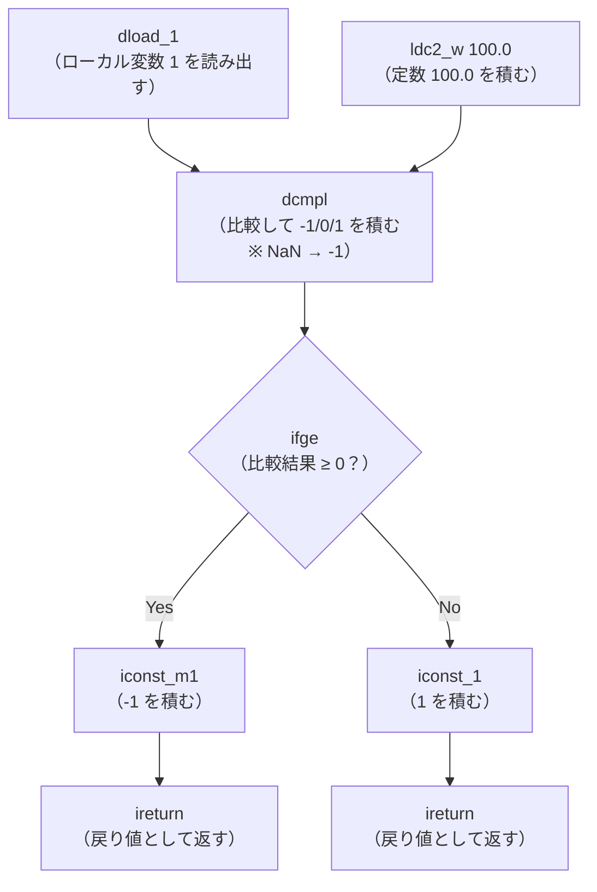

前回の続きです。前回はこちらから。

https://zenn.dev/peyang/articles/reading-jvm-chapter-03-3

このシリーズは，JVM の仕様書を読み解くためのガイドとして構成しています。
JVM の仕様書は非常に長大で難解な内容が多いため，各セクションごとに要点をまとめていきます。
また，JVM の内部構造や動作原理を知ることで，Java のパフォーマンスやセキュリティ，メモリ管理の仕組みを深く理解する試みです。

シリーズはこちらから。

https://zenn.dev/peyang/articles/reading-jvm-chapter-00

## 第三章 Compiling for the Java Virtual Machine

JVM の仕様書の第３章は「Java Virtual Machine のためのコンパイル」です。
この章では，Java ソースコードを JVM が実行可能なバイトコードに変換するためのコンパイル方法について説明しています。

今回からは，実際に JVM の命令と，その動作を理解するための具体的な例を見ていきましょう。

この記事では，様々な制御変数の扱い方について学びます。

ハンド・ブックはこちらから。

https://zenn.dev/peyang/articles/reading-jvm-chapter-03-1

## 3.5 色々なフロー制御の例（[› 3.5 More Control Examples](https://docs.oracle.com/javase/specs/jvms/se24/html/jvms-3.html#jvms-3.5)）

[JVM を読む | JVM をハックする その３ - 定数と変数で制御する編](https://zenn.dev/peyang/articles/reading-jvm-chapter-03-3)では，`for` 文のコンパイル方法について学びました。

今回は，Java 言語の他の制御構文について，そのコンパイル方法を見ていきます。
これらは `for` 文と同じ用に，分かりやすい方法でコンパイルできます。
（なお `switch` 文のコンパイル方法については別の記事で扱います。）

### `while` 文のコンパイル

`while` ループは，JVM で使える簡単な命令の組み合わせで実現できます。
さらに先ほどの記事で紹介した `for` 文のコンパイル方法に非常に似ています。
以下の例では，`int` 型の制御変数 `i` を使って，`i` が 100 より小さい間ループを実行します。
ループの内部では `i` の値を 1 ずつ増やします。

```java
void whileInt() {
    int i = 0;
    while (i < 100) {
        i++;
    }
}

```

これをコンパイルすると以下のようになります。

```java
void whileInt() {
    iconst_0            // 定数 0 をスタックに積む
    istore_1            // ローカル変数 i に値を格納する
    goto LoopCheck      // ループ条件のチェックへジャンプ
    
  LoopBody:
    iinc 1 1           // ローカル変数 i の値を 1 増やす

  LoopCheck:
    iload_1            // ローカル変数 i の値をスタックに積む
    bipush 100         // 定数 100 をスタックに積む
    if_icmplt LoopBody // i < 100 の場合はループの本体へジャンプ
    
    return             // メソッドを終了する
}
```

:::details javap スタイルの命令例
```java
Method whileInt()
0   iconst_0            // 定数 0 をスタックに積む
1   istore_1            // ローカル変数 i に値を格納
2   goto 8              // ループ条件のチェックへジャンプ
5   iinc 1 1            // ローカル変数 i の値を 1 増やす
8   iload_1             // ローカル変数 i の値をスタック
9   bipush 100          // 定数 100 をスタックに積む
11  if_icmplt 5         // i < 100 の場合はループの本体へジャンプ
14  return              // メソッドを終了する
```
:::

この例では，`while` 文の条件をチェックするために `if_icmplt` 命令を使用しています。
さらに前記事で学んだように，制御変数が `int` 方であるため，全て `int` 系の命令を使用しています。

以下の図は，この一連の命令の流れを示しています。



#### ループ条件のチェックは前？後？

通常 Java の `while` 文では，ループの条件を先頭に記述します。
そのため，これをコンパイルすると得られる命令列において，ループ条件の判定は先頭に作成されるように思えます。
しかしながら，実際には先頭にはループ条件の判定命令はなく，むしろループ本体の後にそれが配置されていることが分かります。

ではなぜ，わざわざこのようにしているのでしょうか。

実はこのようにループ条件を後に配置することで，複数回ループしたときにかかる命令数を大幅に抑えられるのです。

##### ループ条件を先頭に配置した場合

ではここで，もし仮にループ条件を先頭に配置した場合を考えてみましょう。
以下の抜粋した命令列を見てください。
```java
LoopCheck:
  if_icmpge End         // ループ条件のチェック
  ...                   // ループの本体
  goto LoopCheck        // ループの本体が終わったら，先頭（ループ条件のチェック）へ戻る。
End:
```

この命令列では，最初にループの条件を判定し，ループが終わったと判断されるならば `End` へジャンプします。
ループを続けるならば，その次のループ本体に自然遷移して，その後は `goto LoopCheck` 命令で先頭へ戻って再度ループします。



例えばこの命令列が 100 回ループする場合を考えてみましょう：
+ `if_icmpge End` 命令：100 回
+ `goto LoopCheck` 命令：99 回

つまり**計 199 回のジャンプ命令が実行される**ことになります。

##### ループ条件を後に配置した場合

では次に，ループ条件を後に配置した場合を考えてみましょう。
以下の抜粋した命令列を見てください。
```java
goto LoopCheck          // 初回はループ本体を飛ばして，ループ条件のチェックへジャンプする。
LoopBody:
  ...                   // ループの本体
LoopCheck:
  if_icmplt LoopBody    // ループ条件のチェックをして，ループの本体にジャンプする。
```

この命令列では，ループ本体のすぐ後ろに条件判定を置くことで，**ループ本体の実行後にジャンプなしで自然に条件判定へ遷移できます**。



これも同じく，この命令列が 100 回ループする場合を考えてみましょう：
+ `goto LoopCheck` 命令：1 回
+ `if_icmplt LoopBody` 命令：99 回

つまり**計 100 回のジャンプ命令が実行される**ことになります。

##### ループ条件を後に配置するメリット

このように，ループ条件を後に配置することで，ジャンプ命令の実行数を約半分に抑えられます。
特に `while` 文のようにループ回数が多いことが前提の構文では，この最適化は非常に効果的です。

もちろん **ループが一度も実行されないようなケース**では，初回の `goto` 命令が無駄になります。
ですが，全体を俯瞰してみると「多数開ループする場合での性能向上」のほうが圧倒的にメリットが大きいのです。

この考え方は `for` 文などの他のループ構文にも応用されており，Java コンパイラや JVM が**ジャンプ命令の回数を意識して命令列を生成している**ことがよく分かります。

### `double` 型での `while` 文のコンパイル

他のデータ型の制御変数を使った構文について見てみましょう。
これらも `int` 型の制御変数を使った `while` 文と同様にコンパイルできますが，その型に合った命令を使用する必要があります。
このため，使用する命令がやや多く必要になり，少々効率の悪いコードになります。

以下の例では，`double` 型の制御変数 `d` を使って，`d` が 100.1 より小さい間ループを実行します。

```java
void whileDouble() {
    double d = 0.0;
    while (d < 100.1) {
        d++;
    }
}
```

これをコンパイルすると以下のようになります。

```java
void whileDouble() {
    dconst_0            // 定数 0.0 をスタックに積む
    dstore_1            // ローカル変数 d に値を格納する
    goto LoopCheck      // ループ条件のチェックへジャンプ
  LoopBody:
    dload_1             // ローカル変数 d の値をスタックに積む
    dconst_1            // 定数 1.0 をスタックに積む
    dadd                // スタックの上の 2 つの値を加算して結果をスタックに積む
    dstore_1            // 結果をローカル変数 d に格納する
  LoopCheck:
    dload_1             // ローカル変数 d の値をスタックに積む
    ldc2_w 100.1        // 定数 100.1 をスタックに積む
    dcmpg               // スタックの上の 2 つの値を比較して，結果をスタックに積む
    iflt LoopBody       // d < 100.1 の場合はループの本体へジャンプ
    return              // メソッドを終了する
}
```

:::details javap スタイルの命令例
```java
Method whileDouble()
0   dconst_0            // 定数 0.0 をスタックに積む
1   dstore_1            // ローカル変数 d に値を格納
2   goto 9              // ループ条件のチェックへジャンプ
5   dload_1             // ローカル変数 d の値をスタックに積む
6   dconst_1            // 定数 1.0 をスタックに積む
7   dadd                // スタックの上の 2 つの値を加算して結果をスタックに積む
8   dstore_1            // 結果をローカル変数 d に格納
9   dload_1             // ローカル変数 d の値をスタックに積む
10  ldc2_w #4           // 定数 100.1 をスタックに積む
13  dcmpg               // スタックの上の 2 つの値を比較して，結果をスタックに積む
14  iflt 5              // d < 100.1 の場合はループの本体へジャンプ
17  return              // メソッドを終了する
```

なお，このときのランタイム定数プールを以下に抜粋します。
```java
#4: double 100.1
```
:::

このように，`double` 型の制御変数を使った `while` 文では，`dconst_0` 命令で初期値を設定し，`dload_1` 命令で制御変数の値をスタックに積みます。
また，`dadd` 命令で制御変数の値を 1 増やし，`dcmpg` 命令で制御変数と定数の比較を行います。
最後に`iflt` 命令でループの条件をチェックし，必要に応じてループの本体へジャンプします。

以下の図は，この一連の命令の流れを示しています。



    #### 命令は完全には直交していない

ここで，或る読者は次のように考えるかもしれません：
「`int` 型の制御変数を使ったループでは `if_icmplt` 命令が使われていたのに，これは `dcmpg` 命令のあとに `iflt` 命令が使われている。なぜだろう？」と。

言いたいことは良くわかります。

たしかに `int` 型の制御変数を使ったループでは，比較と分岐が一体化した `if_icmplt` 命令が使われていました。
一方で `double` 型の制御変数を使ったループでは，まず`dcmpg` 命令という命令で比較をしたあとに，`iflt` 命令でジャンプをしています。
つまり，比較とジャンプが別々になっているのです。

なら，「`int` 型でも `icmpg` 命令と `iflt` 命令で良いのでは？」と思うかもしれませんし，「`double` 型にも `if_dcmpgt` 命令を用意すればいいのでは？」とも考えたくなります。
（なお `icmpg` 命令は存在しませんし，`if_dcmpgt` 命令も存在しません。）

実はここには，JVM の命令セット設計上の制約が関係しています。

##### 命令数には限界がある

JVM の命令はオペコードとオペランドで構成されており，このうちオペコードは命令の種類を表す 1 バイト（8 ビット = 256）の値です。
これが意味することは，**JVM の命令は 256 種類までしか定義できない**ということです。

この限られた数の中で命令をやりくりしなければならないため，型ごとに専用の命令を大量に定義することができないのです。

##### `int` 型 だけが特別扱いされている理由

それなのに，なぜ `int` 型用の `if_icmp<op>` 命令はあるのに，`double` 型用の `if_dcmp<op>` 命令がないのでしょうか？

ここで，`if_icmp_<op>` 命令が使用できる型と，`dcmpg` および `fcmpg` 命令が使用できる型を見てみましょう。

| 型         | `if_icmp_<op>` 命令 | `dcmpg` 命令 | `fcmpg` 命令 |
|-----------|-------------------|------------|------------|
| `byte`    | ○                 | ×          | ×          |
| `char`    | ○                 | ×          | ×          |
| `short`   | ○                 | ×          | ×          |
| `int`     | ○                 | ×          | ×          |
| `boolean` | ○                 | ×          | ×          |
| `long`    | ×                 | ×          | ×          |
| `float`   | ×                 | ×          | ○          |
| `double`  | ×                 | ○          | ×          |

これからわかるように，`if_icmp<op>` は `int` 型だけでなく，`byte` 型や `char` 型，`short` 型， `boolean` 型にも使える汎用的な命令です。
これらは全て `int` 型と同じ扱いでスタック上に載せられる（32ビット幅であるから）ため，1 命令で済ませられるのです。

つまり，**使用頻度が高く**，かつ**共通化しやすい** `int` 系の型だけは，**特別に比較と分岐の複合命令が用意されている**というわけです。

さらにそれだけが理由ではありません。

##### `long` 型や `float` 型，`double` の比較ジャンプが共通化できない理由

比較するときのことを考えてみましょう。
`int` 型の値を比較するときは，単純に 32 ビットの整数を比較すれば良いので，`if_icmplt` 命令のような命令で済みます。
一方で `long` や `double` は 64 ビット幅ですから，１つの値がスタックの２スロット分を占有します。
そのため，スタックの操作はより複雑になり，一概に同じ方式では実装できないのです。

さらに `float` 型や `double` 型の比較は，NaN（*Not a Number*）や無限大（*Infinity*）などの特殊な値を考慮する必要があります。
特に前者は何と比較しても「等しく」ありませんし，大小関係も常に偽となります。
このため，JVM では `fcmpg` や `dcmpg` のように NaN を大きいとみなす命令，一方で `fcmpl` や `dcmpl` のように NaN を小さいとみなす命令が定義されているのです。



このように，分岐命令を個別に定義するより，比較処理を共通化しておくほうが，命令数の節約にも，パフォーマンスの向上にも寄与するのです。

### 適切な浮動小数点命令の選択

`double` 型の制御変数を使った `while` 文の例では，`dcmpg` 命令を使用していました。
前述の通り，浮動小数点の比較には，型ごとにそれぞれ異なる命令が用意されています。
+ `float` 型：
  - `fcmpg`：NaN を大きいとみなす比較
  - `fcmpl`：NaN を小さいとみなす比較
+ `double` 型：
  - `dcmpg`：NaN を大きいとみなす比較
  - `dcmpl`：NaN を小さいとみなす比較
  
これらの命令は，*NaN* の扱いに差があるだけです。

前述の通り *NaN* には順序がありません。
そのため浮動小数点数の比較は，オペランドが *NaN* の場合は常に偽となります。

コンパイラは *NaN* ではない値の比較で失敗した場合にも，そうではない場合にも，同じ結果を返すような適切な比較命令を選択する必要があります。
例えば以下のコードについて考えてみましょう。

```java
void lessThan100(double d) {
    if (d < 100.0) {
        return 1;
    } else {
        return -1;
    }
}
```

これをコンパイルすると以下のようになります。

```java
void lessThan100(double d) {
    dload_1             // ローカル変数 d の値をスタックに積む
    ldc2_w 100.0        // 定数 100.0 をスタックに積む
    dcmpg               // d が NAN または d > 100.0 の場合は 1 をスタックに積む
                        // d が 100.0 の場合は 0 をスタックに積む
    ifge Else           // d が 100.0 以上の場合は Else へジャンプ
    iconst_1            // 1 をスタックに積む
    ireturn             // 1 を返す
  Else:
    iconst_m1           // -1 をスタックに積む
    ireturn             // -1 を返す
}
```

:::details javap スタイルの命令例
```java
Method lessThan100(double)
0   dload_1             // ローカル変数 d の値をスタック
1   ldc2_w #4           // 定数 100.0 をスタックに積む
4   dcmpg               // d が NAN または d > 100.0 の
5   ifge 10             // d が 100.0 以上の場合は Else へジャンプ
8   iconst_1            // 1 をスタックに積む
9   ireturn             // 1 を返す
10  iconst_m1           // -1 をスタックに積む
11  ireturn             // -1 を返す
```
なお，ランタイム定数プールを以下に抜粋します。
```java
#4: double 100.0
```
:::




この例では，`dcmpg` 命令を使用して `d` が *NaN* であるかどうかをチェックしています。  
`dcmpg` 命令は次のように動作します：
- `d` が *NaN* の場合はスタックに `1` を積む
- `d` が `100.0` 未満の場合は スタックに `-1` を積む
- `d` が `100.0` の場合は スタックに `0` を積む
- `d` が `100.0` 以上の場合は スタックに `1` を積む

つまりこのコードは，`d` が  `100.0` 未満の場合は `1` を返し，それ以外の場合は `-1` を返すように適切にコンパイルされます。

#### 間違った命令を使った場合

ではここで，もし間違って `dcmpg` 命令の代わりに `dcmpl` 命令を使った場合を考えてみましょう。

この場合には *NaN* の扱いが変わり，`d` が *NaN* の場合は `-1` を返すようになります。
さらに `ifge` 命令は `d` が *NaN* の場合にジャンプしなくなり，`iconst_1` 命令が実行されてしまいます。

つまり， `d < 100.0` や `d == NaN` の場合にも `1` を返すようになり，コードの意図とは異なってしまいます。



IEEE 754 浮動小数点数の仕様に従うと，*NaN* はどの値とも等しくないため，あらゆる比較は偽となります。
したがって，コンパイラはこのような *NaN* の扱いの違いを踏まえて，意味的に正しい比較になるように `Tcmpg` 命令，或いは `Tcmpg` 命令を選択します。

なお `dcmpl` 命令と `ifle` 命令を使用しても，以下のように同じ結果を得られます。
```java
int greaterThan100(double d) {
    if (d > 100.0) {
        return 1;
    } else {
        return -1;
    }
}
```

これは以下のようにコンパイルされます。

```java
int greaterThan100(double d) {
    dload_1             // ローカル変数 d の値をスタックに積む
    ldc2_w 100.0        // 定数 100.0 をスタックに積む
    dcmpl               // d が NAN または d < 100.0 の場合は 1 をスタックに積む
                        // d が 100.0 の場合は 0 をスタックに積む
    ifle Else           // d が 100.0 以下の場合は Else へジャンプ
    iconst_1            // 1 をスタックに積む
    ireturn             // 1 を返す
  Else:
    iconst_m1           // -1 をスタックに積む
    ireturn             // -1 を返す
}
```

:::details javap スタイルの命令例
```java
Method greaterThan100(double)
0   dload_1             // ローカル変数 d の値をスタック
1   ldc2_w #4           // 定数 100.0 をスタックに
4   dcmpl               // d が NAN または d < 100.0 の
5   ifle 10             // d が 100.0 以下の場合は Else
8   iconst_1            // 1 をスタックに積む
9   ireturn             // 1 を返す
10  iconst_m1           // -1 をスタックに積む
11  ireturn             // -1 を返す
```

なお，ランタイム定数プールを以下に抜粋します。
```java
#4: double 100.0
```
:::

以下の図は，この一連の命令の流れを示しています。


このように，*NaN* の扱いを適切に考慮することで，コンパイラは正しい比較命令を選択し，意図した動作を実現します。
もし `dcmpg` 命令の両方が存在しなければ，*NaN* を検出するために，さらに多くの命令を必要とすることになるかもしれません。

### まとめ

この記事では，JVM の命令を使った様々なフロー制御の方法について学びました。
特に `while` 文のコンパイル方法や，浮動小数点数の比較命令を選択することのジウ要請について詳しく見てきました。

次回は，メソッドを呼び出す方法について学びます。

### 次回リンク

https://zenn.dev/peyang/articles/reading-jvm-chapter-03-5-6

#### 参考文献＆リンク集

+ Lindholm, T., Yellin, F., Bracha, G., & Smith, W. M. D. (2025). [*The Java® Virtual Machine Specification: Java SE 24 Edition*](https://docs.oracle.com/javase/specs/jvms/se24/html/).
+ Lindholm, T., & Yellin, F. (1999). *The Java™ Virtual Machine Specification* (2nd ed.). Addison-Wesley. ISBN 978-0-201-43294-7
+ Otavio, S. (2024). *Mastering the Java Virtual Machine*.  Packet Publishing. ISBN 978-1-835-46796-1
+ Godfrey, N., & Koichi , M. (2010). *デコンパイリング Java ― 逆解析技術とコードの難読化*  ISBN 978-4-87311-449-1
